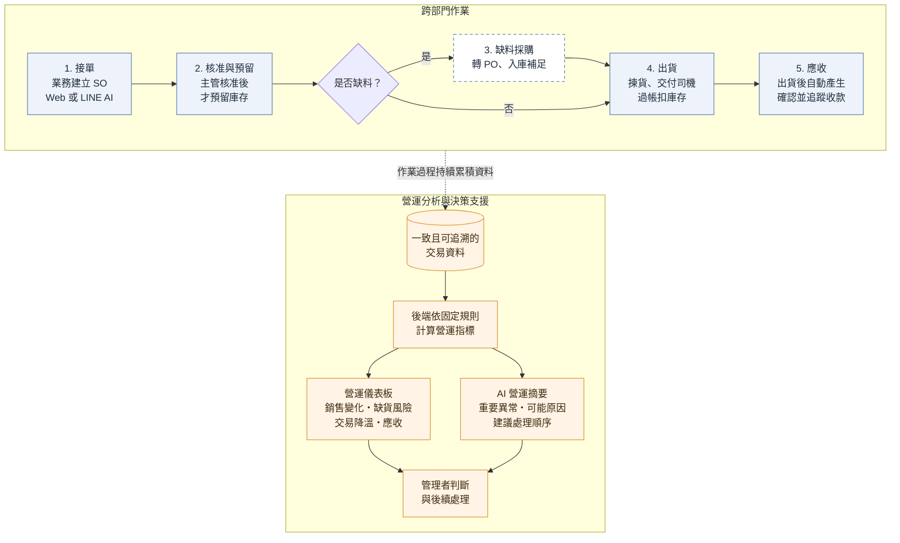
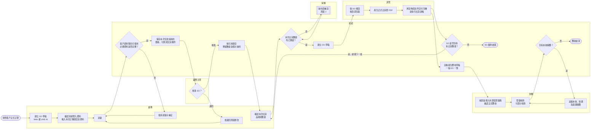
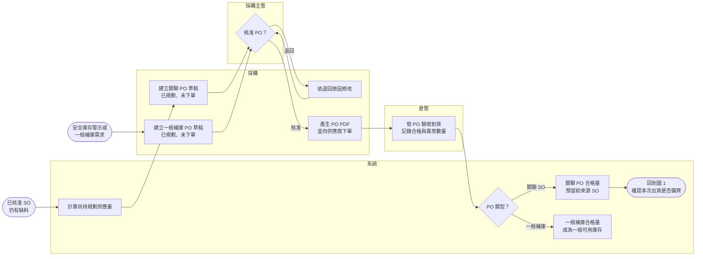

# 核心業務流程

> 文件版本：v1.0  
> 建立日期：2026-09-29  
> 文件定位：說明跨部門作業順序、角色交接及各步驟產生的結果。

---

## 1. 營運流程概覽

此圖用於快速說明跨部門作業如何累積一致且可追溯的交易資料，再形成營運儀表板與 AI 決策支援。後續章節補充角色交接、核准條件及例外情況。

## 2. 前置主檔建立與核准流程

詢價、老闆核價及客戶確認在系統外完成；系統保存已確認的料號對應與客戶價格。下列主檔完成核准或覆核並啟用後，才可供後續 SO、PO 與應收流程使用。這些是交易前置作業，不代表每張訂單都要重新建立。

| 主檔或條件 | 建立或申請 | 覆核或核准 | 生效後用途 |
| --- | --- | --- | --- |
| 客戶基本資料 | 業務 | 業務主管 | 啟用後可建立 SO；新客戶預設採現結 |
| 付款條件 | 業務申請 | 財務主管 | 核准後可於新 SO 使用 30 天或 60 天帳期 |
| 公司料號 | 業務 | 業務主管 | 啟用後可建立客戶料號對應及交易資料 |
| 客戶料號及公司料號對應 | 業務 | 業務主管 | 啟用後，輸入客戶料號可查用對應的公司料號 |
| 客戶價格 | 業務 | 業務主管 | 保存未稅 TWD 單價、計價單位、生效日與失效日；價格失效時提示使用者，但不阻擋建立 SO 草稿 |
| 供應商資料 | 採購 | 採購主管 | 核准後可成為正式採購來源 |

同一人可兼任多個角色，但不得覆核或核准自己建立的資料；實際替代核准與授權原則詳見 [角色與權限規格](04-roles-and-permissions.md)。

## 3. SO 到出貨與應收跨角色泳道圖 (圖1)

此圖呈現正常主流程及各角色之間的交接。缺料時轉入圖 2；取消、短收及驗收異常等情況於第 6 章說明。

SO、PO、庫存、DO、應收與收款等交易節點會持續更新營運資料；儀表板與 AI 摘要不必等待 SO 履約結案或應收結清才更新。

## 4. 缺料與補貨子流程 (圖2)

此圖同時呈現由 SO 缺料建立的關聯 PO，以及不綁定 SO 的一般補庫 PO。只有關聯 PO 的合格入庫量會依來源關係預留給特定 SO。

## 5. 端到端步驟對照表

| 步驟 | 主要角色 | 工作與系統結果 |
| --- | --- | --- |
| 1 | 業務 | 收到客戶正式訂單後，透過 Web 或 LINE AI 建立 SO 草稿。使用 LINE AI 時，系統會提示缺漏或有疑義的內容，業務確認解析結果後才建立草稿。 |
| 2 | 業務／系統 | 系統依客戶料號對應帶入公司料號、成交單價、付款條件及單位換算；業務輸入數量、要求交貨日、交貨方式、地點等本次交易資料，確認後送審。送審時，系統確認客戶、公司料號及料號對應仍可使用，檢查必要資料與成交單價是否完整，並保存本次交易採用的價格、付款及交貨條件。價格失效時顯示警示，但不阻擋送審。 |
| 3 | 業務主管／系統 | 業務主管核准 SO 後，系統依當下可用庫存預留可供貨數量。SO 詳細頁依品項顯示已預留、已規劃未下單、採購在途及尚待規劃供應的數量。預留只會將數量由可用狀態轉為預留狀態，此時不減少實際在庫總量。 |
| 4 | 採購／採購主管 | 缺料時，採購可針對尚待規劃供應的數量建立關聯 PO 草稿，也可依安全庫存警示或實際需求建立一般補庫 PO。採購主管核准後，採購產生正式 PO PDF 並向供應商下單，未到貨的數量從此時起才列為採購在途。 |
| 5 | 倉管／系統 | 供應商到貨後，倉管依 PO 驗收，記錄合格、待檢、不合格與損壞數量。關聯 PO 的合格數量，在來源 SO 仍有需求時預留給該 SO；一般補庫的合格數量，以及超出來源需求的部分，列為一般可用庫存。 |
| 6 | 業務／系統 | 業務依客戶需求確認本次出貨品項、數量、預計出貨日、地點及特殊需求。原則上以剩餘有效數量整批出貨；客戶明確急需時，可選擇部分品項或數量分批出貨。系統確認本次選定數量均已預留後，才建立 DO 草稿。 |
| 7 | 倉管 | 倉管在 DO 頁面產生揀貨單並完成揀貨、核對與包裝，只查看履約所需資料，不取得完整售價等非必要銷售資訊。 |
| 8 | 倉管／系統 | 倉管確認實際出貨品項、數量及必要追溯資訊後，系統產生有正式編號的出貨單 PDF。貨物與文件交付司機時，倉管執行出貨過帳；系統扣減庫存、解除相應預留、更新 SO 的已出貨與未出貨數量，並保存實際出貨日、操作時間及帳號。 |
| 9 | 系統 | DO 過帳後，系統自動產生應收草稿，每張 DO 產生一筆。金額依實際出貨量、SO 保存的未稅成交單價及固定 5% 營業稅計算，到期日依付款條件計算。 |
| 10 | 財務 | 財務核對 DO、含稅金額與外部發票資料，填入外部發票號碼後確認正式應收。 |
| 11 | 財務／系統 | 財務登錄部分或全額收款，每次收款不得超過未收餘額。系統更新未收、即將到期及逾期資料；未收餘額歸零時完成應收結清。 |
| 持續更新 | 管理者／系統 | SO、PO、庫存、DO、應收與收款等資料建立或狀態異動時，系統即依固定規則更新接單、已過帳銷售、缺貨風險、交易降溫及應收指標。管理者可隨時透過儀表板與具有來源依據的 AI 摘要判斷後續處理順序，不必等待整張 SO 履約結案或應收結清。 |

## 6. 核心控制與例外流程

### 6.1 核心控制原則

- SO 核准前不預留庫存，也不能由 SO 建立關聯 PO 或建立 DO。
- PO 草稿與待核准 PO 只代表需求已有規劃；PO 核准並向供應商下單後，尚未合格入庫的數量才是採購在途。
- DO 只能使用已預留給來源 SO 的數量。
- 產生正式出貨單 PDF 不代表實際出庫；倉管將貨物與文件交付司機並執行過帳時才扣減庫存。
- 同一張 DO 不得重複過帳，也不得重複產生應收。
- SO 的有效數量全部出貨過帳後即可履約結案；應收是否收清不影響 SO 的履約狀態。
- 每張已過帳 DO 對應一筆應收；正式應收可分次收款，未收餘額歸零時才完成應收結清。
- 一般補庫入庫、其他 SO 取消後釋放、庫存調增或隔離解除所增加的可用庫存，不自動改配給既有缺料 SO。

### 6.2 例外流程

| 例外情況 | 處理方式 | 系統結果 |
| --- | --- | --- |
| 客戶取消部分未出貨數量 | 業務提出餘量取消申請，由業務主管核准 | 取消尚未出貨的有效數量並釋放相應預留；其餘有效數量全部出貨後，SO 仍可履約結案 |
| SO 取消或減量時已有關聯 PO | 不自動取消已送出的 PO，由採購依實際狀況續辦或另外處理 | 後續合格到貨若已無來源 SO 需求，轉為一般可用庫存 |
| PO 取消或短收後結案 | 採購記錄取消或確認短收結案 | 未被補足的來源 SO 數量重新成為尚待規劃供應量，可再次建立關聯 PO |
| 到貨待檢、不合格或損壞 | 倉管依實際驗收結果記錄數量，倉管主管處理隔離、解除隔離或庫存例外 | 待檢與不合格數量不可供 SO 使用；損壞數量列為不可出貨，所有異動保留原因與操作紀錄 |
| 正式出貨單內容需更正 | 作廢原正式 PDF，依正確內容重新產生 | 保留舊版、新版、作廢原因、操作者與時間；產生 PDF 本身不改變庫存 |

單據狀態、庫存狀態與金額公式詳見 [領域與資料規則](05-domain-rules.md)。

## 7. 示範情境：SO_001

假設客戶與客戶料號對應已啟用，且財務主管已核准客戶採 30 天帳期。客戶訂購 PE 保溫管 10 支與 PU 管墊 5 個，其中 PU 管墊目前只有 2 個可用；客戶未要求急件，因此待缺料補齊後整單出貨。

1. **業務建單**：業務輸入客戶料號，確認系統帶出的公司料號、未稅 TWD 價格及交易單位，完成 SO 草稿並送審。若價格已失效，系統顯示警示，但不阻擋建立明細；送審前仍須具備可採用的成交單價。
2. **主管核准與庫存預留**：業務主管核准後，系統預留 PE 保溫管 10 支與 PU 管墊 2 個，並顯示 PU 管墊尚有 3 個缺少供應來源。
3. **缺料採購**：採購以缺少的 3 個 PU 管墊建立關聯 PO 草稿。草稿只代表已規劃供應；採購主管核准、產生 PO PDF 並向供應商下單後，3 個才列為採購在途。
4. **驗收入庫**：到貨後，倉管依 PO 驗收。3 個合格品依 PO 與 SO_001 的關係直接預留給該訂單；待檢、不合格或損壞數量不列為可用庫存。
5. **建立 DO 與揀貨**：整張訂單的出貨數量均已預留後，業務確認本次出貨內容，由系統建立 DO 草稿；倉管產生揀貨單並完成揀貨、核對及包裝。
6. **出貨文件與過帳**：倉管確認實際出貨內容後產生正式出貨單 PDF。貨物及文件交付司機時執行出貨過帳，系統扣減庫存、解除相應預留、更新 SO，並保存實際出貨日與操作紀錄。由於有效訂購數量已全部出貨，SO 完成履約結案。
7. **產生及確認應收**：系統依實際出貨量、SO 保存的未稅成交單價及 5% 營業稅建立應收草稿。財務填入外部發票號碼並確認正式應收，到期日為實際出貨日加 30 日。
8. **收款與結清**：財務先登錄部分收款，系統保留未收餘額並持續判定到期或逾期；收到剩餘款項後再次登錄，未收餘額歸零，應收完成結清。
9. **營運分析**：主管可在儀表板查看接單、已過帳銷售、缺貨風險、交易降溫及應收資料；AI 摘要使用同一組後端指標整理重要異常、可能原因、建議處理順序與來源連結。

LINE AI 可取代第 1 步的輸入方式，但不改變送審、核准及後續履約流程。
