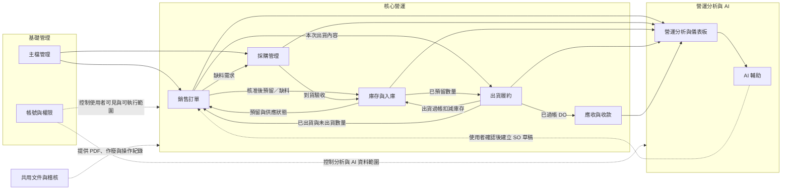

# 功能模組拆分

> 文件版本：v1.0  
> 建立日期：2026-09-29  
> 最後更新：  
> 文件定位：依業務能力拆分系統模組，說明各模組的責任、主要功能與跨模組交接。

---

## 1. 模組拆分原則

- 以使用者要完成的業務工作拆分模組，不以畫面、資料表或程式類別作為模組邊界。
- 每項交易資料由一個主要模組負責，其他模組透過明確的業務事件或後端服務取得結果，避免重複維護。
- 帳號與權限由 M01 提供，所有模組共用同一套身分、角色與個別權限判斷；文件產生及稽核紀錄則由 C01 提供跨模組共用能力。
- 營運分析使用核心流程累積的交易資料；AI 使用後端已整理的結構化資料，不直接取代交易規則或核准責任。
- 本文件描述邏輯功能模組，不代表必須拆成多個獨立部署服務；實際程式架構於系統設計階段決定。

## 2. 模組總覽

模組依用途分成三類：

- **基礎管理**：提供身分、權限與可重複使用的主檔資料。
- **核心營運**：完成從接單、採購、庫存、出貨到應收的交易流程。
- **營運分析與 AI**：將交易資料轉為指標、警訊與可追溯的管理摘要。

M01 帳號與權限及 C01 共用文件與稽核為跨模組能力，適用於主檔、核心營運、營運分析與 AI 等所有模組。總覽圖僅標示主要交易資料流，詳細觸發事件與交接結果以第 4 節為準。

## 3. 模組與功能對照

| 編號 | 模組 | 模組目的 | 主要功能 | 主要使用角色 |
| --- | --- | --- | --- | --- |
| M01 | 帳號與權限 | 控制使用者可查看及執行的功能 | 帳號管理、多角色、角色權限與個別額外授權、登入控制、LINE 帳號本人綁定與解除 | 系統管理員、營運主管 |
| M02 | 主檔管理 | 建立後續交易共用的一致資料 | 客戶、供應商、公司料號、偏好供應商、客戶料號、料號對應、商品單位換算、客戶價格版本、對應主管啟用或停用主檔，以及財務主管直接設定付款條件 | 業務、採購、各主檔覆核或管理角色 |
| M03 | 銷售訂單 | 將客戶正式需求轉為可履行且可追蹤的 SO | Web 建立草稿、接收已由使用者確認的 LINE AI 解析結果建立草稿、自動帶入交易資料、送審檢查、保存本次交易條件、主管核准或退回、整合庫存與採購資料呈現供應狀態、計算尚待規劃供應量、未出貨餘量取消 | 業務、業務主管 |
| M04 | 採購管理 | 將缺料或補庫需求轉為正式採購作業 | SO 缺料建立關聯 PO、一般補庫 PO、採購主管核准或退回、PO PDF、供應商下單、已規劃未下單與採購在途追蹤、採購主管直接取消未收貨 PO 或處理短收結案；不含應付與供應商付款 | 採購、採購主管 |
| M05 | 庫存與入庫 | 管理可出貨實體數量、預留與庫存異動 | PO 驗收入庫、過帳前確認、合格與異常數量、由採購主管維護的安全庫存政策、期初庫存、預留與釋放、不侵蝕預留的庫存調整、相反方向更正及異動追溯 | 採購主管、倉管、倉管主管 |
| M06 | 出貨履約 | 將已核准且完成預留的 SO 轉為實際出貨 | 業務通知出貨、建立 DO 預計出貨量、分批出貨、揀貨單、倉管確認實際出貨量、揀貨與包裝、正式出貨單 PDF、`DRAFT / READY / POSTED / VOIDED` 狀態、交付司機及出貨過帳 | 業務、倉管 |
| M07 | 應收與收款 | 將實際出貨轉為可追蹤的客戶應收資料 | DO 過帳後建立應收草稿、未稅金額與營業稅、到期日、外部發票號碼、正式應收確認、外部發票資料的可追溯更正、部分或全額收款、未收與逾期追蹤；不含應付帳款 | 財務、財務主管 |
| M08 | 營運分析與儀表板 | 將跨模組交易資料轉為一致的管理指標 | 淨接單與營收、客戶／商品營收貢獻、未出貨訂單、缺貨風險、平均日出貨量、可支撐天數、平均採購週期、建議安全庫存、客戶交易降溫、應收到期與逾期、待辦事項、期間篩選與來源下鑽 | 營運主管及具相應查看權限者 |
| M09 | AI 輔助 | 降低輸入負擔並協助管理者閱讀營運資料 | LINE AI 單輪需求解析、缺漏與歧義提示、解析結果預覽及確認後建 SO 草稿；依後端指標產生營運摘要、可能原因、處理順序與來源連結 | 業務、營運主管 |
| C01 | 共用文件與稽核 | 提供跨模組一致的文件與追溯能力 | 每張 PO／DO 一份正式 PDF、作廢紀錄、重要操作及授權異動紀錄 | 各授權角色、系統管理員 |

## 4. 跨模組交接

| 觸發事件 | 來源模組 | 接收模組 | 交接結果 |
| --- | --- | --- | --- |
| 主檔核准或覆核並啟用 | 主檔管理 | 銷售訂單／採購管理 | 已啟用的客戶、料號、價格與供應商可供交易查用 |
| SO 核准 | 銷售訂單 | 庫存與入庫 | 依當下可用庫存執行預留，並回傳各品項的預留結果 |
| 預留或採購供應狀態變動 | 庫存與入庫／採購管理 | 銷售訂單 | 更新 SO 各品項的供應狀態，由銷售訂單模組重新計算尚待規劃供應量 |
| SO 出現尚待規劃供應量 | 銷售訂單 | 採購管理 | 採購可建立關聯 PO 草稿，避免同一缺料重複規劃 |
| PO 核准並向供應商下單 | 採購管理 | 庫存與入庫 | 未到貨數量列為採購在途，供缺貨與交期判斷使用 |
| 關聯 PO 合格入庫並完成預留 | 庫存與入庫 | 銷售訂單 | 庫存模組將來源 SO 仍需的合格數量轉為預留，銷售訂單更新各品項的供應狀態 |
| 未出貨餘量取消核准 | 銷售訂單 | 庫存與入庫 | 釋放取消數量所占用的預留，使其恢復為可用庫存 |
| PO 取消或短收結案 | 採購管理 | 銷售訂單 | 移除未補足數量原有的供應規劃，重新計算為尚待規劃供應量 |
| 業務確認本次出貨內容 | 銷售訂單 | 出貨履約 | 系統檢查選定數量均已預留後建立 DO 草稿 |
| DO 出貨過帳 | 出貨履約 | 庫存與入庫／銷售訂單 | 扣減庫存、使用相應預留；銷售訂單由已過帳 DO 重新計算已出貨與未出貨數量 |
| DO 出貨過帳 | 出貨履約 | 應收與收款 | 每張已過帳 DO 建立一筆應收草稿 |
| 交易建立或狀態異動 | 核心營運模組 | 營運分析與儀表板 | 交易資料成為指標查詢來源；後端於查詢時依既定計算基準產生指標、警訊及待辦事項，不另保存指標快照 |
| 使用者確認 LINE AI 解析結果 | AI 輔助 | 銷售訂單 | 透過既有後端服務建立 SO 草稿，不直接送審或核准 |
| 後端完成營運指標計算 | 營運分析與儀表板 | AI 輔助 | AI 依結構化資料產生摘要，並附上可查證的來源連結 |

## 5. 模組責任邊界

### 5.1 交易與庫存

- 銷售訂單模組決定 SO 的需求與核准狀態；庫存模組負責可出貨實體數量、預留及庫存異動。
- 銷售訂單模組整合 SO 需求、庫存預留及採購供應資料，分別呈現已預留、已規劃未下單、採購在途與尚待規劃數量；計算結果不代表銷售訂單模組可直接修改庫存或 PO。
- 採購模組負責 PO 與供應進度；入庫後的實際數量由庫存模組管理。
- 出貨模組負責 DO 與履約執行；只有出貨過帳才能扣減實際庫存並觸發應收。
- 庫存調整由倉管主管直接過帳，不另走通用核准；調減不得超過可用庫存，侵蝕預留時系統拒絕操作；錯誤以相反方向的新調整更正。
- 應收模組使用已過帳 DO 與 SO 保存的交易條件計算金額，不回頭修改 SO、DO 或庫存資料。

### 5.2 營運分析與 AI

- 儀表板指標由後端依固定規則計算，並可下鑽至來源交易資料。
- AI 營運摘要只使用後端提供的結構化指標與來源資訊，不自行計算或變更金額、庫存與逾期判定。
- LINE AI 以單輪方式解析一則完整需求並建立 SO 草稿；缺漏或歧義時要求使用者重新送出完整內容。送審、核准、預留、採購、過帳及應收仍由既有模組與授權角色處理。
- AI 功能不得繞過帳號權限、資料查看範圍或人工確認。

### 5.3 共用能力

- 各交易模組依其業務規則決定何時產生正式文件；共用能力負責版型、每張 PO／DO 的單一正式檔案保存及作廢紀錄。需更正時作廢原單據並建立新單據。
- 各模組在重要操作發生時寫入一致的稽核紀錄，但稽核紀錄不得取代原始交易資料。
- 功能模組共享同一套角色與個別權限判斷，不在各模組另建互相矛盾的授權規則。

## 6. 與其他設計文件的關係

- 角色可執行哪些模組功能，詳見 [角色與權限規格](04-roles-and-permissions.md)。
- 跨模組共用的狀態、公式與交易限制，詳見 [領域與資料規則](05-domain-rules.md)。
- 儀表板指標與決策問題，詳見 [營運分析與儀表板需求](06-analytics-and-dashboard.md)。
- LINE AI 與 AI 營運摘要的把關流程，詳見 [AI 功能需求](07-ai-features.md)。
- 實體關係、資料責任與完整性限制，詳見 [邏輯資料模型](10-data-model.md)。
- 程式模組、AWS 元件與部署方式，詳見 [系統架構](13-system-architecture.md)。
