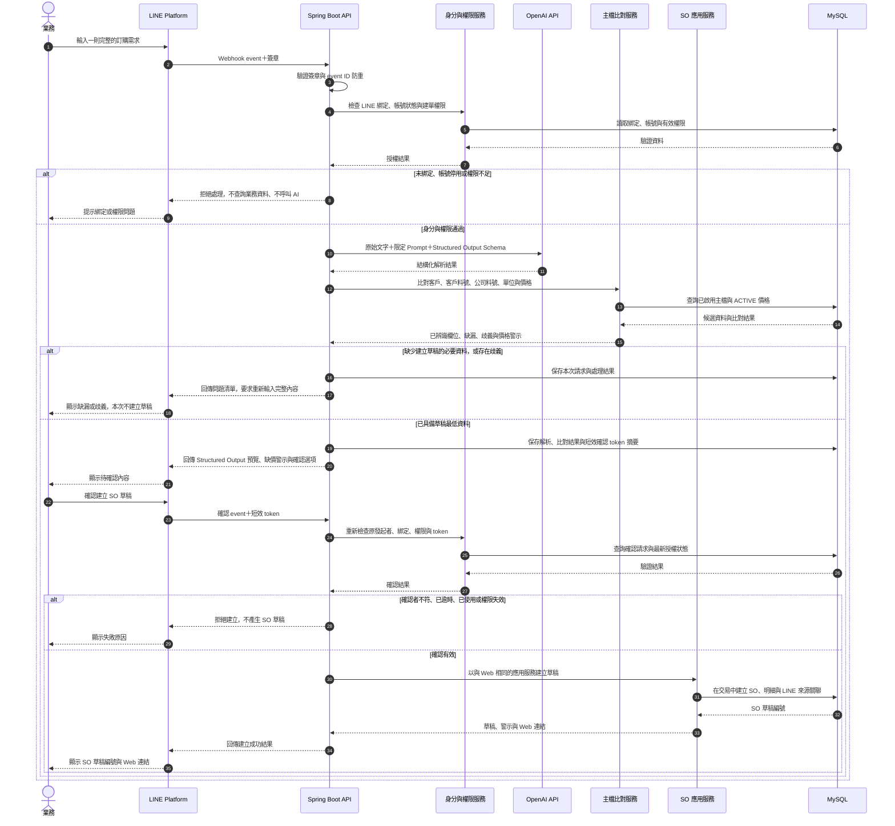

# AI 功能需求

> 文件版本：v1.0  
> 建立日期：2026-09-29  
> 最後更新：  
> 文件定位：定義 LINE AI 建立 SO 草稿與 AI 營運摘要的產品行為、權限及驗收邊界。

## 共通原則

- AI 只負責理解、整理與說明，不取代後端的身分驗證、權限、資料查詢、公式或交易規則。
- AI 不直接連線或任意查詢資料庫，只能呼叫已授權的後端服務。
- AI 不得直接送審、核准、預留庫存、建立正式 PO、通知出貨、過帳、修改正式交易或對外聯繫。
- 所有 AI 輸出必須允許使用者查證；無法證實的推論使用「可能」或「建議確認」等措辭。

## LINE AI 建立 SO 草稿

### 使用者與授權

本次專題的 LINE AI 功能僅供內部業務使用。加入 LINE 官方帳號不代表取得權限。

1. 使用者先登入 Web 系統，取得只能使用一次、5 至 10 分鐘內失效的驗證碼。
2. 使用者把驗證碼傳給 LINE 機器人，後端以該訊息的 LINE userId 完成本人綁定。
3. 一個 LINE userId 只能綁定一個系統帳號；本次交付範圍內，一個系統帳號也只綁定一個 LINE userId。
4. APP_ADMIN 可查看綁定狀態、停用或解除綁定，但不能替使用者指定 LINE userId。
5. 每次處理訊息時，後端重新驗證 webhook、綁定狀態、帳號狀態及 `LINE_AI_SO_DRAFT_CREATE` 權限。
6. 驗證失敗時，不得查詢內部資料或呼叫建單工具。
7. 驗證碼只保存以伺服器端祕密金鑰計算的摘要，金鑰由部署環境的祕密管理或環境注入提供，不存入資料庫、版本庫或日誌。
8. 系統依 LINE userId 限制一定期間內的失敗次數；驗證碼只能成功使用一次，逾期或超過嘗試限制後即失效。

### 建單流程

本次專題採單輪模式：每一則業務訊息都是獨立請求，不沿用前一則訊息的對話上下文。

1. 業務輸入客戶、客戶訂單編號、客戶料號或品項描述、數量、單位、交期、地點及備註；一則訊息可包含多個品項。
2. AI 將文字解析為 Structured Output，但不自行決定公司料號、價格、庫存或權限。
3. 後端依授權查詢客戶、客戶料號對應、公司料號、交易單位及價格。
4. 資料只有一筆符合時可自動帶入；缺少必要輸入、單位不明、有多筆候選或存在歧義時，後端依解析與主檔比對結果列出問題，不得讓 AI 自行猜測；使用者須重新送出一則完整描述。
5. 查無可用客戶或料號對應、必須先建立主檔時，後端明確回傳目前無法建立草稿，並引導使用者到 Web 完成建檔或覆核。
6. 缺少 `ACTIVE` 價格不阻擋產生 item line 預覽或 SO 草稿，但 AI 與系統須顯示待補價格警示；該 SO 在價格完成建檔及覆核前不得送審。
7. 當系統具備建立草稿所需的最低資料後，後端組合完整 Structured Output 預覽，包括已辨識欄位、缺漏及警示。
8. 只有原發起者明確確認預覽後，後端才建立 `SO_DRAFT`，並回傳草稿編號、警示與 Web 連結。
9. 業務回到 Web 檢查、補齊內容並自行送審；LINE AI 的工作到建立草稿為止。

### LINE AI 建單循序圖

下圖呈現完整文件流程。AI 只將文字轉為結構化解析結果；身分與權限驗證、主檔比對、警示判斷與 SO 草稿建立都由後端處理。



循序圖中的「缺價警示」不會阻擋 SO 草稿建立，但 Web 送審時仍必須引用 `ACTIVE` 價格。圖中的授權失敗、解析失敗或確認失效都不得建立交易草稿。

### Structured Output 最低內容

- 客戶識別結果。
- 客戶訂單編號，如有提供。
- 一筆以上品項：原始文字、客戶料號或描述、解析後公司料號、數量、單位。
- 要求交期、交貨方式、地點與備註，如有提供。
- 價格狀態：`ACTIVE` 或缺漏。
- 無法辨識欄位、歧義及警示。

此處只定義產品需要的語意欄位，不代表最終 API DTO 或資料表設計。

### 紀錄與防重複

系統保存：

- 綁定帳號及 LINE userId 對應。
- 一次性驗證碼的摘要、到期與使用狀態，以及依 LINE userId 保存的驗證嘗試結果與時間；不保存使用者輸入的驗證碼。
- 原始輸入。
- AI 解析結果與 Structured Output。
- 使用者最終確認內容。
- 工具呼叫及建立結果。
- 發生時間與錯誤資訊。

確認操作只允許原發起者執行，並具有效期限及 LINE event ID 防重，避免 webhook 重送造成同一內容重複建立 SO 草稿。多輪補問、跨訊息候選選擇及會話記憶列為後續擴充。

## AI 營運摘要

### 輸入來源

後端先依 [06-analytics-and-dashboard.md](06-analytics-and-dashboard.md) 的固定口徑產生結構化分析資料，再交由 AI 組織摘要。可包含：

- 統計期間及產生時間。
- 接單與營收變化；營收採已過帳 DO 實際出貨未稅金額。
- 主要增加或下降的客戶與商品。
- 缺貨風險、已規劃未下單與採購在途狀況。
- 近 30 天平均日出貨量、可支撐天數、平均採購週期及建議安全庫存。
- 交易降溫客戶。
- 未收、即將到期及逾期應收。
- 對應客戶、商品及單據的來源識別碼或連結。

### 產生方式與保存

- 只有具備 `AI_SUMMARY_GENERATE` 權限的營運主管可在 Web 儀表板主動要求產生摘要。
- 摘要沿用當下儀表板的期間及篩選條件，不另行接受自然語言查詢資料庫。
- 每次產生均保存結構化輸入、結構化輸出、模型資訊、狀態、產生者及時間，供後續查閱與重現。
- 本次專題不提供排程產生、Email 寄送或摘要 PDF。
- AI 產生失敗時顯示錯誤並保留失敗紀錄，不影響儀表板與規則型分析的正常使用。

### Structured Output

AI 回傳固定結構，不接受自由格式作為正式摘要結果：

```text
executiveSummary
importantChanges[]
risks[]
possibleCauses[]
recommendedActions[]
sourceReferences[]
dataLimitations[]
```

`importantChanges`、`risks`、`possibleCauses` 與 `recommendedActions` 的項目至少包含：

```text
title
description
severity
evidence
sourceReferenceIds[]
```

後端只接受本次結構化輸入中已提供的來源識別碼，驗證 `sourceReferenceIds` 後再建立系統連結。AI 不得自行生成資源 ID 或任意 URL。

呈現內容包含本期最重要的變化與異常、依既有查詢結果整理的可能原因、依影響程度排列的處理順序、具體行動建議及可回到系統查證的來源。資料不足或前期為零時，須寫入 `dataLimitations`。

### 限制

- AI 不自行計算指標。
- AI 不任意查詢資料庫。
- AI 不修改或核准交易。
- AI 不把規則型交易降溫直接描述為客戶已流失。
- AI 可依本專題定義稱已過帳 DO 實際出貨未稅金額為「營收」，但不得描述為會計總帳營收或法定收入認列結果。
- AI 不跨不同商品單位計算或解讀全公司平均出貨單價。
- AI 只能把客戶、商品、取消及未出貨狀態描述為可能原因或相關變化；沒有直接證據時不得宣稱因果關係。
- AI 只提供營運問題的摘要與建議優先順序；個人待核准與待處理作業仍由 HOME-01「我的工作台」提供，AI 不得成為唯一待辦入口。
- AI 不得由 PO 採購單價推論供應商已付款、實際現金支出、會計成本或毛利；本次系統沒有應付與付款資料。
- 資料不足時明確說明，不補造原因或數字。

## 專題驗收標準

- 未綁定、停用或無權限帳號無法取得內部資訊。
- 相同輸入重複送出不會建立重複草稿。
- 歧義或缺漏會明確列出，不由 AI 猜測；使用者重新送出完整描述後才再次解析。
- 建立草稿前一定顯示 Structured Output 並取得原發起者確認。
- `ACTIVE` 價格缺漏會在預覽及 Web 草稿中保留警示，且阻擋 SO 送審。
- AI 摘要與儀表板在相同條件下使用相同數字。
- 摘要的關鍵結論可連回來源資料驗證。
