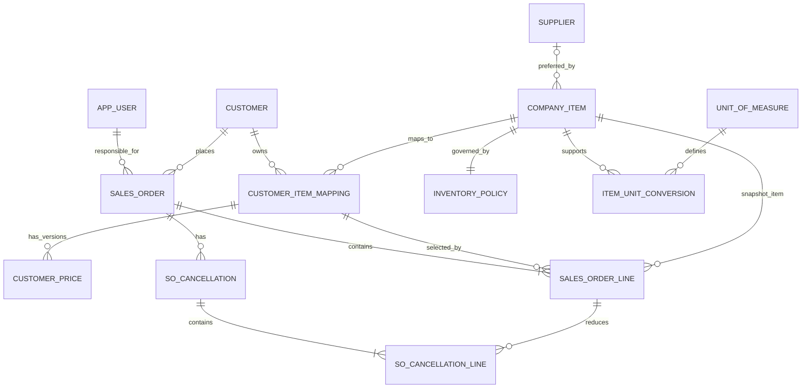
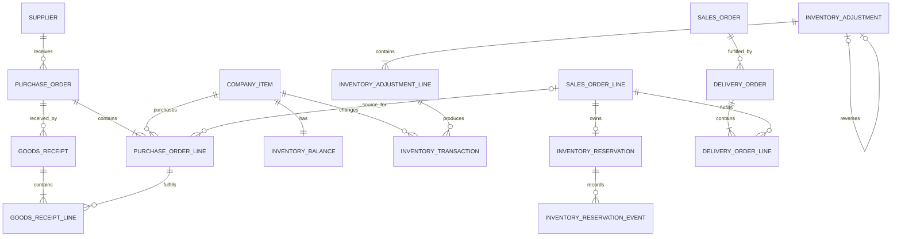
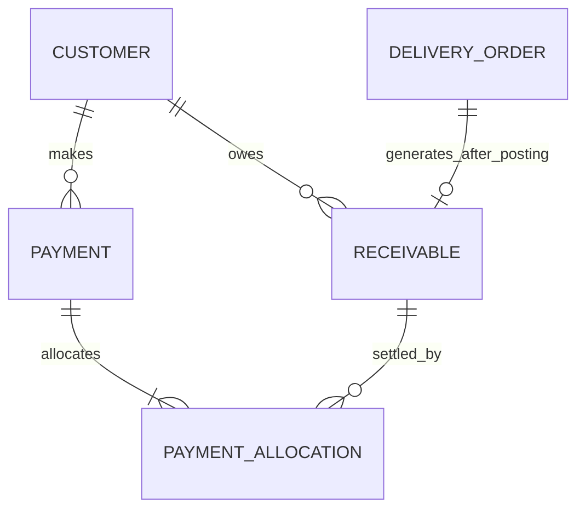
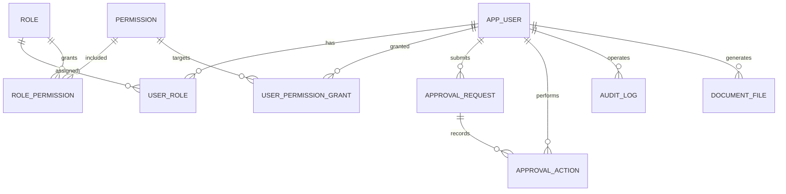
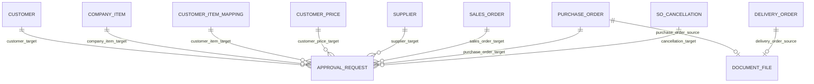

# 邏輯資料模型

> 文件版本：v1.0  
> 建立日期：2026-10-04  
> 最後更新：  
> 文件定位：依已確認的產品需求、業務流程、領域規則與決策紀錄，定義核心資料實體、關係、責任與一致性限制。

---

## 1. 模型範圍與前提

- 系統服務單一公司及單一倉庫，不建立租戶、公司或多倉調撥模型。
- 每種可獨立交易及管理庫存的規格建立一個公司料號。
- 本次專題只處理 TWD，不建立多幣別換算。
- 不建立批號、序號、隔離或損壞庫存；只有驗收合格數量計入可出貨實體庫存。
- 一張 SO 可分批產生多張 DO；一張 DO 只屬於一張 SO。
- 一張已過帳 DO 只產生一筆應收。
- 一張 PO 可包含多張 SO 的需求及一般補庫，但每筆 PO 明細最多只對應一筆 SO 明細。
- 採購資料模型止於 PO、到貨驗收與入庫；不建立供應商發票、應付帳款、付款或應付核銷實體。
- 儀表板主要由交易資料查詢計算，不先建立永久統計資料表。
- 正式保存的 PDF 只包含 PO 與 DO；每張單據只保存一份正式檔案及作廢資訊。

詳細採用理由請參閱 [09-decision-log.md](09-decision-log.md)。

## 2. 資料設計原則

### 2.1 表頭與明細

SO、PO、收貨、DO、取消申請及收款核銷等具有多品項或多分配資料的交易，使用表頭與明細分開保存。表頭負責交易對象、狀態及共同條件，明細負責品項、數量、價格與來源關係。

### 2.2 交易條件快照

SO 送審時保存實際採用的公司料號、客戶料號、成交單價、稅率、付款條件、交易單位、換算倍率及交貨資料。主檔後續異動不得直接改寫既有交易。

PO 明細保存本次採購單價、單位及換算倍率。系統可帶入同一供應商與公司料號最近一次已核准 PO 單價，但該數值只是輸入預設，不是供應商價格主檔。

### 2.3 目前狀態與不可修改歷程

庫存及預留均採「目前狀態＋事件歷程」：目前狀態供查詢與鎖定，事件歷程只新增、不修改、不刪除，並可重新驗算目前值。

已完成交易若需更正，使用取消、作廢或反向紀錄，不直接覆蓋原始結果。

### 2.4 數量與金額

- SO、PO、收貨、DO 與庫存相關資料同時保存使用者輸入數量、交易單位、換算倍率及基準數量。
- 庫存餘額、異動、預留與預留事件全部使用公司料號的庫存基準單位。
- 售價及 PO 採購單價保存未稅 TWD；應收依實際出貨量、SO 單價快照及 5% 稅率計算。PO 單價不代表已付款或會計成本。
- SO 明細須明確保存計價單位、計價所使用的數量、未稅單價及送審時計算的未稅小計；表頭總額由明細依固定四捨五入規則計算並保存，使核准、DO、應收及分析採用相同金額基準。

### 2.5 資料停用與刪除

已被交易引用的主檔不做實體刪除，改以啟用狀態控制後續使用。已送審、核准、過帳、收款或作廢的交易及其歷程不得實體刪除。

## 3. 核心實體總覽

| 範圍 | 主要實體 | 主要責任 |
| --- | --- | --- |
| 帳號與權限 | `app_user`、`role`、`permission`、角色與權限關聯 | 登入身分、多角色、個別額外授權與最終權限計算 |
| 主檔 | `customer`、`supplier`、`company_item`、`inventory_policy`、單位換算、客戶料號對應與客戶價格 | 提供交易可重複使用且經核准的資料與預設政策 |
| 銷售 | `sales_order`、`sales_order_line`、餘量取消申請與明細 | 保存正式需求、交易快照、核准狀態與有效數量 |
| 採購 | `purchase_order`、`purchase_order_line` | 保存關聯 SO 及一般補庫需求、PO 採購單價、核准與供應進度 |
| 驗收入庫 | `goods_receipt`、`goods_receipt_line` | 保存分批到貨、合格、損壞與規格不符數量 |
| 庫存與預留 | `inventory_balance`、`inventory_transaction`、`inventory_reservation`、`inventory_reservation_event`、庫存調整表頭與明細 | 保存實體數量、異動、承諾、例外調整及其來源 |
| 出貨 | `delivery_order`、`delivery_order_line` | 保存分批履約、實際出貨及過帳結果 |
| 應收與收款 | `receivable`、`payment`、`payment_allocation` | 保存應收、實際入帳與多筆核銷關係 |
| 核准與稽核 | `approval_request`、`approval_action`、`audit_log` | 保存每輪送審、決定與重要操作紀錄 |
| 文件 | `document_file` | 保存 PO／DO 單一正式 PDF 的位置及作廢資訊 |
| LINE 與 AI | LINE 綁定與驗證、單輪 AI 請求、Webhook 防重及 `ai_operational_summary` | 保存本人綁定、單輪解析確認、SO 草稿來源及摘要紀錄 |

## 4. 主檔與銷售資料模型



### 4.1 主檔實體

| 實體 | 主要資料 | 關係與限制 |
| --- | --- | --- |
| `customer` | 客戶編號、名稱、統編、聯絡資料、付款條件、狀態 | 新客戶預設 `DUE_0`；付款條件只由財務主管直接修改；核准後的啟用、停用與重新啟用由業務主管處理，異動前後值、原因、操作者與時間寫入稽核紀錄 |
| `supplier` | 供應商編號、名稱、統編、聯絡資料、狀態 | 核准啟用後才可建立正式 PO；核准後的啟用、停用與重新啟用由採購主管處理 |
| `company_item` | 公司料號、名稱、材質與規格、庫存基準單位、偏好供應商、狀態 | 每種獨立庫存規格一筆；公司料號唯一；偏好供應商可為空且只作為 PO 預設值；核准後的啟用、停用與重新啟用由業務主管處理 |
| `inventory_policy` | 公司料號、安全庫存基準數量、版本 | 與公司料號一對一，料號建立時同步建立，安全庫存預設為 0；停用料號仍保留；只由採購主管或具相應細部權限者修改，異動前後值寫入稽核紀錄 |
| `unit_of_measure` | 單位代碼、名稱、小數位規則 | 供商品換算及交易單位使用 |
| `item_unit_conversion` | 公司料號、交易單位、換算倍率、用途 | 同一料號與單位組合唯一；倍率須大於零 |
| `customer_item_mapping` | 客戶、客戶料號、公司料號、狀態 | 同一客戶的有效客戶料號只對應一個公司料號；一個公司料號可被多個客戶料號使用；核准後的啟用、停用與重新啟用由業務主管處理 |
| `customer_price` | 客戶料號對應、計價單位、未稅單價、狀態、建立與覆核資料 | 狀態為 `PENDING_REVIEW / ACTIVE / REJECTED / REPLACED / REVOKED`；同一客戶料號與計價單位最多一筆 `ACTIVE`，新版本核准時立即取代舊版本 |

### 4.2 SO 與取消實體

| 實體 | 主要資料 | 關係與限制 |
| --- | --- | --- |
| `sales_order` | SO 編號、客戶、客戶訂單編號、負責業務、建立者、建立管道、狀態、付款條件快照、要求交期、交貨方式與地點、未稅總額、稅額、含稅總額、首次核准時間、版本 | 建立管道為 `WEB / LINE_AI`；核准前不得預留、建立關聯 PO 或產生 DO；送審與核准歷程由核准實體保存 |
| `sales_order_line` | SO、行號、公司料號、客戶料號快照、輸入數量與單位、換算倍率、基準數量、`ACTIVE` 價格來源、計價數量與單位、未稅單價、未稅小計與稅率快照 | 送審須引用 `ACTIVE` 價格；核准後不可直接更換公司料號；已出貨與已取消數量由已過帳 DO 及已核准取消明細計算 |
| `so_cancellation` | SO、申請者、狀態、原因、申請與核准時間 | 每次取消申請獨立保存並進入核准流程 |
| `so_cancellation_line` | 取消申請、SO 明細、取消基準數量 | 核准後減少有效需求並產生預留釋放事件 |

負責業務與建立者分開保存。主管代建或 LINE AI 建立草稿時，仍須有明確的負責業務。

## 5. 採購、入庫、庫存與出貨資料模型



### 5.1 PO 與收貨實體

| 實體 | 主要資料 | 關係與限制 |
| --- | --- | --- |
| `purchase_order` | PO 編號、供應商、狀態、預計到貨日、建立者、核准及下單時間、取消或結案資料 | 狀態為 `DRAFT / PENDING_APPROVAL / RETURNED / APPROVED / PARTIALLY_RECEIVED / CLOSED / CANCELLED`；一張 PO 只能有一個供應商及 TWD 幣別；核准後才列入採購在途 |
| `purchase_order_line` | PO、行號、公司料號、用途、來源 SO 明細、輸入數量與單位、換算倍率、基準數量、未稅採購單價、取消基準數量、明細狀態、結案原因與時間 | 用途為關聯 SO 時來源 SO 明細必填；一般補庫時必須為空；每筆明細最多對應一筆 SO 明細；狀態為 `OPEN / COMPLETED / CLOSED_SHORT / CANCELLED` |
| `goods_receipt` | 收貨編號、PO、實際到貨日、驗收者、狀態、確認與過帳時間 | 一張 PO 可分批建立多張收貨紀錄；過帳前須顯示完整確認內容，狀態為 `POSTED`；過帳後不得修改，本次專題不建立收貨沖銷模型 |
| `goods_receipt_line` | 收貨、PO 明細、輸入實收數量與單位、換算倍率、實收基準數量、合格、損壞、規格不符基準數量、異常原因 | 合格、損壞與規格不符數量合計等於本次實收；只有合格數量產生實體入庫異動 |

同一公司料號若供應不同 SO 明細，必須建立不同 PO 明細。已知超出來源 SO 尚待規劃供應量的數量，另建一般補庫明細。

### 5.2 庫存與預留實體

| 實體 | 主要資料 | 關係與限制 |
| --- | --- | --- |
| `inventory_balance` | 公司料號、可出貨實體數量 `on_hand_qty`、版本、更新時間 | 每個公司料號建立時即建立一筆；停用後仍保留；只由庫存服務更新 |
| `inventory_transaction` | 公司料號、基準數量增減、異動類型、來源、原因、操作者、發生時間 | 只新增；類型至少包含期初、合格入庫、出貨、調整與反向更正 |
| `inventory_reservation` | SO 明細、公司料號、目前有效預留 `open_qty`、版本 | 每筆 SO 明細最多一筆；只由庫存服務更新 |
| `inventory_reservation_event` | 預留、事件類型、基準數量、核准申請／收貨明細／DO 明細／取消明細等可為空來源外鍵、操作者、發生時間 | 只新增；事件為 `RESERVE`、`CONSUME` 或 `RELEASE`，數量一律大於零；來源外鍵須依事件來源恰好一個有值 |
| `inventory_adjustment` | 調整編號、原因類型、說明、狀態、操作者、過帳時間、原始或相反方向調整關係 | 不另走通用核准；狀態為 `POSTED / REVERSED`。原因類型包含 `OPENING_BALANCE` 與盤點差異等；期初庫存只允許正數，且每個尚無庫存異動、預留或交易的公司料號只能建立一次 |
| `inventory_adjustment_line` | 調整、公司料號、基準數量增減、原因 | 一次調整可包含多個商品；每筆明細只產生實體庫存異動，不產生預留事件 |

預留事件的來源限制：

| 事件與來源 | 必填關係 | 結果 |
| --- | --- | --- |
| `RESERVE / SO_APPROVAL` | 核准申請 | SO 核准後依可用庫存增加預留 |
| `RESERVE / PO_RECEIPT` | 合格收貨明細 | 關聯 PO 合格入庫後補足來源 SO 預留 |
| `CONSUME / DO_POSTING` | DO 明細 | 出貨過帳後使用相應預留 |
| `RELEASE / SO_CANCELLATION` | 取消明細 | 餘量取消核准後釋放相應預留 |

庫存調增可直接執行；調減不得超過當下可用庫存。若調減後 `on_hand_qty` 將低於有效預留總量，系統拒絕操作並列出受影響 SO。庫存調整不產生預留事件，也不重新分配既有缺料 SO。

### 5.3 DO 實體

| 實體 | 主要資料 | 關係與限制 |
| --- | --- | --- |
| `delivery_order` | DO 編號、SO、狀態、預計與實際出貨日、建立及過帳者、過帳時間 | 狀態為 `DRAFT / READY / POSTED / VOIDED`；一張 DO 只屬於一張 SO；只能成功過帳一次 |
| `delivery_order_line` | DO、SO 明細、預計出貨數量與單位、換算倍率、預計基準數量、實際出貨數量與單位、實際基準數量 | 同一 SO 明細所有未過帳、未作廢 DO 的預計數量合計不得超過有效預留；`READY` 時實際量須大於 0 且不得超過預計量；少出的差額保留於來源 SO；過帳後依實際量產生出貨異動及預留使用事件 |

`READY` 表示揀貨與數量確認完成、正式 DO PDF 已產生，等待交付司機並過帳。`DRAFT` 或 `READY` 可作廢；`READY` 作廢時對應 PDF 一併作廢，但不扣庫存或使用預留。需更正時建立新 DO，每張 DO 只保存一份正式 PDF。`POSTED` 不直接作廢。

## 6. 庫存一致性與併發控制

```text
on_hand_qty
＝該公司料號所有有效 inventory_transaction.quantity_change 加總

reservation.open_qty
＝RESERVE 事件加總－CONSUME 事件加總－RELEASE 事件加總

可用庫存
＝on_hand_qty－該公司料號所有 reservation.open_qty 加總
```

必須維持：

1. `on_hand_qty ≥ 0`。
2. `reservation.open_qty ≥ 0`。
3. `on_hand_qty ≥ 同一公司料號的有效預留總量`。
4. 餘額與實體異動加總一致。
5. 預留目前值與預留事件加總一致。

SO 核准、關聯 PO 合格入庫、DO 建立或修改、DO 過帳及庫存調整須在同一資料庫交易中：

1. 依公司料號固定順序鎖定 `inventory_balance`。
2. 重新查詢目前餘額及有效預留，不使用畫面載入時的舊數字。
3. 驗證操作後仍符合一致性規則。
4. 新增不可修改的異動或預留事件。
5. 更新對應的目前狀態。

DO 建立、修改及過帳時，還須鎖定相關預留與有效 DO 明細，重新加總同一 SO 明細所有 `DRAFT / READY` 數量，避免多張 DO 草稿各自通過檢查後合計超用預留。

一致性檢查應納入自動化測試，並可於展示前執行，列出餘額或預留不一致的公司料號與差異。

## 7. 應收與收款資料模型



| 實體 | 主要資料 | 關係與限制 |
| --- | --- | --- |
| `receivable` | 應收編號、DO、客戶、狀態、未稅金額、稅額、含稅總額、付款條件、到期日、外部發票號碼與日期 | 每張已過帳 DO 恰有一筆；正式應收的外部發票號碼不得重複；財務主管只能更正外部發票號碼或日期，更正前後值與原因由稽核紀錄保存 |
| `payment` | 客戶、client request ID、收款日期、含稅收款金額、方式、外部參考號碼、狀態、建立及作廢資料 | 一筆代表一筆實際入帳；`client_request_id` 唯一，用於防止網路重試造成重複收款；確認後不直接修改 |
| `payment_allocation` | 收款、應收、核銷金額 | 同一收款只能核銷同一客戶的正式應收；金額大於零且不得超過未收餘額 |

本次專題不處理預收、溢收或未分配款，因此一筆 `CONFIRMED` 收款的有效核銷明細加總必須等於收款金額。收款作廢時保留表頭與核銷明細，未收餘額只加總 `CONFIRMED` 收款的有效核銷。

```text
未收餘額
＝應收含稅總額－有效 payment_allocation 加總
```

確認收款時須鎖定涉及的應收，重新驗證未收餘額，再於同一交易中寫入收款與核銷明細。收款作廢屬財務例外，由財務主管處理。

## 8. 核准、權限、文件與稽核



### 8.1 帳號與授權

| 實體 | 主要資料 | 關係與限制 |
| --- | --- | --- |
| `app_user` | 帳號、姓名、密碼雜湊、狀態 | 停用後不得登入或執行交易 |
| `role` | 角色代碼、名稱、狀態 | 角色是一組預設權限 |
| `permission` | 權限代碼、資源、操作 | 作為後端及前端一致的細部授權單位 |
| `user_role` | 使用者、角色 | 使用者可有多個角色 |
| `role_permission` | 角色、權限 | 定義角色預設權限 |
| `user_permission_grant` | 使用者、權限、原因、有效期間 | 只提供角色以外的額外授權，不提供個別 `DENY` |

任何人不得修改自己的角色或個別權限。授權異動須保存異動前後內容、操作者及時間。

### 8.2 核准歷程

| 實體 | 主要資料 | 關係與限制 |
| --- | --- | --- |
| `approval_request` | 業務類型、各目標資料之外鍵、送審輪次、申請者、狀態、送審時間 | 每筆恰好一個目標外鍵有值且與業務類型一致；每次退回後重新送審建立新一輪，保留舊輪次 |
| `approval_action` | 核准申請、操作者、操作角色、是否替代核准、動作、意見、時間 | 保存送審、核准、退回等不可修改歷程 |

核准申請的目標外鍵至少包含客戶、公司料號、客戶料號對應、客戶價格、供應商、SO、PO 及未出貨餘量取消。付款條件由財務主管直接設定，不屬於核准目標。核准者不得是目標資料的建立者，也不得是本輪申請者；此跨表規則由服務層驗證並以整合測試覆蓋。

### 8.3 正式文件與稽核

| 實體 | 主要資料 | 關係與限制 |
| --- | --- | --- |
| `document_file` | 文件類型、PO 或 DO 外鍵、正式編號、檔案位置、雜湊、狀態、產生與作廢資料 | 類型只支援 PO 與 DO；兩個來源外鍵恰好一個有值且與類型一致；每張單據最多一份正式 PDF，作廢後保留但不建立同單據版本鏈 |
| `audit_log` | 操作者、操作類型、業務資料、異動摘要、時間、必要原因 | 記錄重要操作及授權異動，不取代交易或核准原始資料 |

PDF 檔案本身存放於檔案儲存空間，不直接存入一般關聯資料表。

核准與文件目標關係示意：



圖中關係皆為可選外鍵，但每筆 `approval_request` 或 `document_file` 必須透過檢查限制保證恰好一個目標有值。`audit_log` 是非權威操作紀錄，可使用目標類型加 ID 的通用記法。

## 9. LINE AI 與營運摘要資料

| 實體 | 主要資料 | 關係與限制 |
| --- | --- | --- |
| `line_account_binding` | 系統使用者、LINE user ID、狀態、綁定與解除時間 | 一個有效 LINE 身分只能綁定一個系統帳號；綁定由本人透過一次性驗證完成 |
| `line_binding_code` | 系統使用者、驗證碼摘要、到期時間、使用時間、狀態 | 只保存以伺服器端祕密金鑰計算的 HMAC 摘要；驗證碼只能成功使用一次，逾期即失效 |
| `line_inbound_event` | LINE event ID、LINE user ID、事件類型、接收與處理時間、處理結果 | event ID 唯一，用於 webhook 防重及驗證嘗試計數；不保存使用者輸入的驗證碼 |
| `line_ai_request` | 發起使用者、LINE event、原始文字、AI 解析結果、後端比對結果、缺漏與警示、狀態、確認期限與時間、提示詞與 schema 版本、建立的 SO | 每則訊息是獨立請求；狀態為 `PARSED / CONFIRMED / EXPIRED / FAILED`；多品項可保存於結構化 JSON，未經原發起者確認不得建立 SO 草稿 |
| `ai_operational_summary` | 產生者、分析期間與篩選、狀態、結構化指標輸入、結構化輸出、錯誤摘要、模型資訊、產生時間 | 每次按需產生均保存一筆；來源識別碼須由後端驗證並能回到交易或分析明細，AI 失敗不影響儀表板資料 |

AI 不直接修改主檔、核准、庫存、應收或權限資料。LINE AI 建立的 SO 草稿與 Web 建立的草稿使用相同交易實體及後續流程。資料缺漏或有歧義時，請使用者重新送出完整訊息；多輪會話與草稿版本鏈不在本次專題交付範圍。

HMAC 伺服器金鑰不得保存在資料庫、Git 版本庫或日誌；由部署環境的祕密管理服務或環境變數注入。本機設定若使用檔案，該檔案不得提交版本控制。

## 10. 衍生值與保存值

| 資料 | 處理方式 |
| --- | --- |
| 可用庫存 | 由 `on_hand_qty－有效預留總量` 計算 |
| 已規劃未下單量 | 由關聯 SO 明細且狀態為草稿、待核准或退回的 PO 未取消數量計算 |
| 採購在途量 | 由已核准採購量、合格入庫量及 `cancelled_base_qty` 計算；短收結案時未到貨餘量轉為取消量 |
| 尚待規劃供應量 | 由 SO 尚未供應需求扣除已預留、已規劃未下單及採購在途計算，最低為 0 |
| SO 已出貨、已取消與未出貨數量 | 由已過帳 DO 與已核准取消明細動態計算，不在 SO 明細重複保存 |
| 應收未收餘額 | 由應收含稅總額減有效核銷明細加總計算 |
| 逾期及即將到期 | 依到期日、今日與未收餘額動態判定 |
| 儀表板指標 | 由交易資料依 [06-analytics-and-dashboard.md](06-analytics-and-dashboard.md) 的計算基準查詢，不先永久保存統計結果 |

`inventory_balance.on_hand_qty` 與 `inventory_reservation.open_qty` 雖然可以從歷程重算，仍保存為受控的目前狀態，以支援鎖定、即時查詢及一致性驗證。

## 11. 重要唯一性與完整性限制

| 限制 | 目的 |
| --- | --- |
| 公司料號唯一 | 避免不同商品共用庫存識別 |
| 客戶＋客戶料號在有效資料中唯一 | 避免輸入客戶料號後得到多個公司料號 |
| 同一客戶料號與計價單位最多一筆 `ACTIVE` 價格 | 確保 SO 送審取得唯一的已覆核價格，新版啟用時舊版轉為 `REPLACED` |
| SO、PO、收貨與 DO 的表頭編號各自唯一 | 提供可追溯的業務識別 |
| PO 關聯明細只能指向一筆 SO 明細 | 落實方案 C 的來源粒度 |
| 每筆 SO 明細最多一筆預留目前狀態 | 統一查詢與事件累積位置 |
| DO 明細必須指向同一張 DO 所屬 SO 的明細 | 防止跨訂單錯誤出貨 |
| 同一 SO 明細的有效 DO 草稿總量不得超過有效預留 | 防止多張 `DRAFT / READY` DO 合計超用同一筆預留 |
| 每張已過帳 DO 最多一筆應收 | 避免重複請款 |
| 正式應收的外部發票號碼唯一 | 避免重複登錄發票 |
| 每個公司料號最多一筆 `OPENING_BALANCE` 期初異動 | 防止重複建立期初庫存；存在其他異動、預留或交易時也不得新增 |
| 同一收款與應收組合最多一筆有效核銷明細 | 避免重複分配；輸入確認前可在畫面調整，確認後須作廢整筆收款再重登 |
| LINE user ID 只允許一個有效綁定 | 防止同一 LINE 身分冒用多個帳號 |
| `line_inbound_event.line_event_id` 唯一 | 防止 webhook 重送造成重複解析、確認或建單 |
| `payment.client_request_id` 唯一 | 防止收款請求因網路重試而重複入帳 |

跨資料表的數量、核准者不得為建立者或本輪送審者、收款全額分配及個別授權等限制，由後端服務在資料庫交易中驗證，並以整合測試覆蓋。

## 12. 後續實體資料庫設計事項

邏輯模型確認後，再於實體設計階段決定：

- MySQL 8.4 欄位型別、長度、精度、字元集與索引。
- 狀態及類型採資料庫列舉、檢查限制或代碼表。
- `ACTIVE` 客戶價格唯一性使用 Generated Column＋Unique Index，或交易鎖定搭配服務層檢查的實作方式。
- 明確目標外鍵的欄位命名、索引及「恰好一個有值且與類型一致」檢查限制實作方式。
- JSON 結構化資料的 schema、版本及敏感資料遮蔽方式。
- PDF 使用 AWS S3 儲存時的 object key、metadata、雜湊與存取方式。
- 高併發操作的交易隔離層級、悲觀鎖定及重試策略。
- 儀表板查詢 View、索引及未來彙總表需求。

實體設計不得改變本文件已確認的業務關係；若實作發現需要調整，應先更新需求或決策紀錄，再同步修改資料模型。
