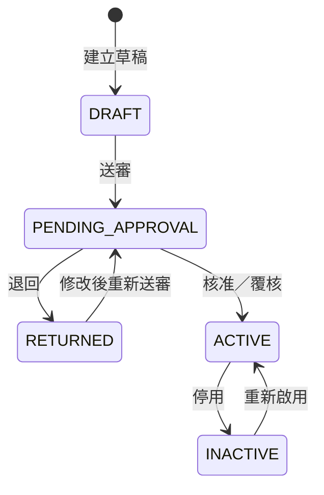
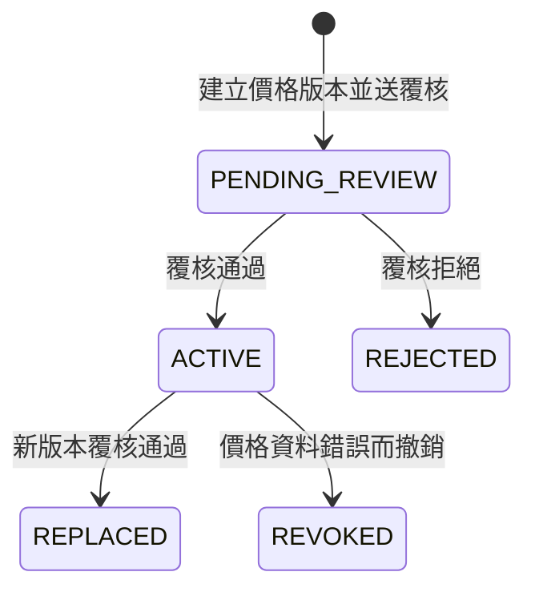
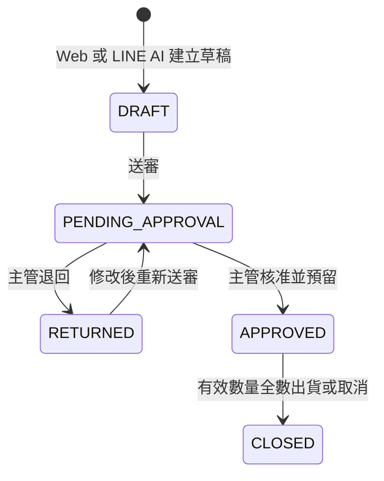
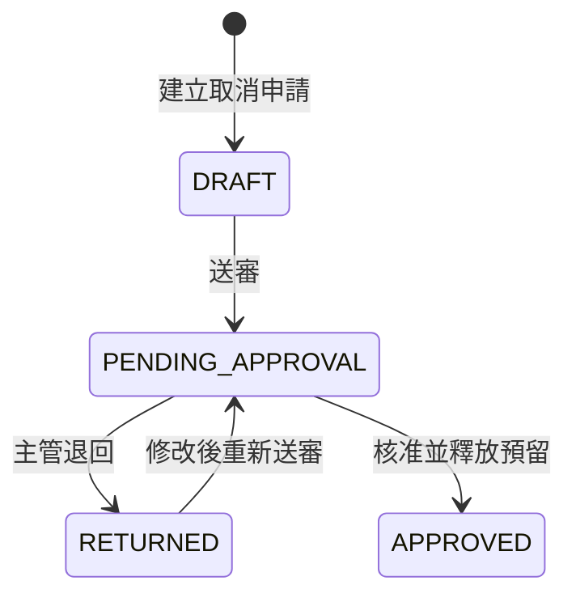
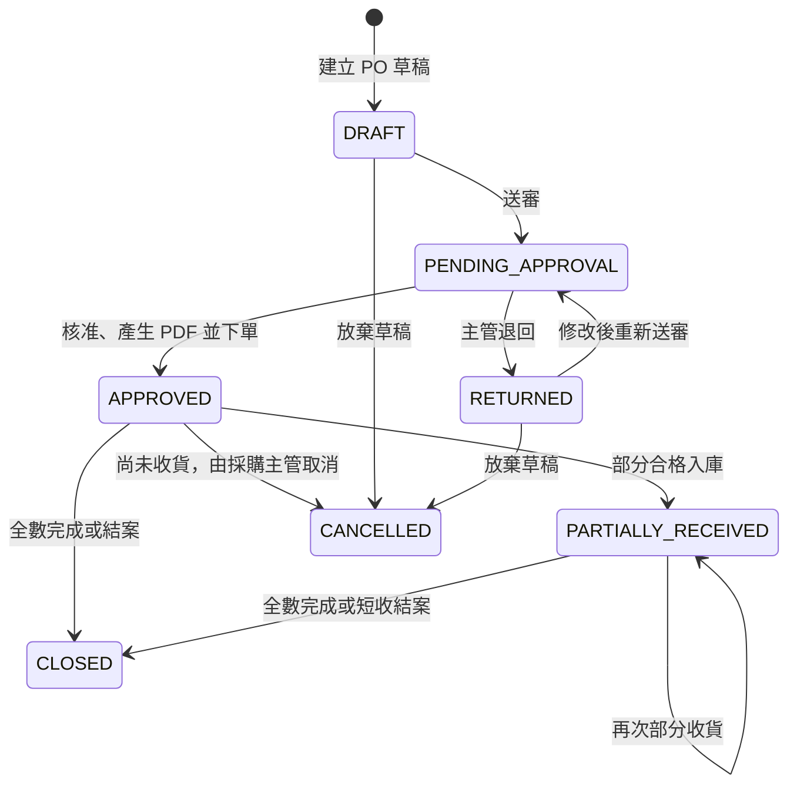
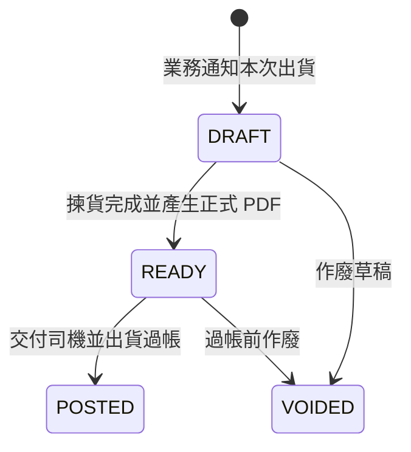
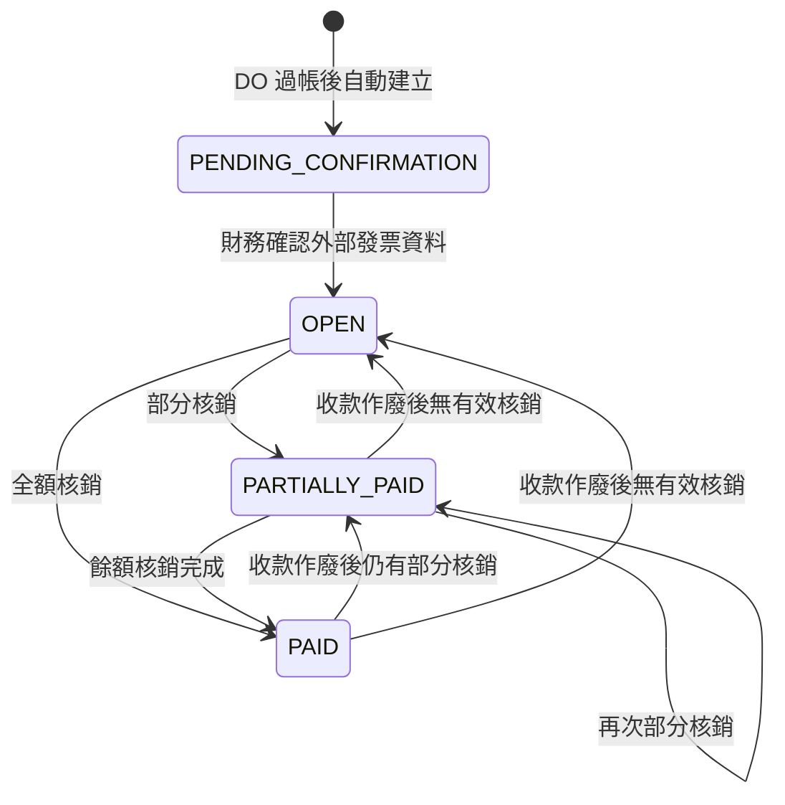
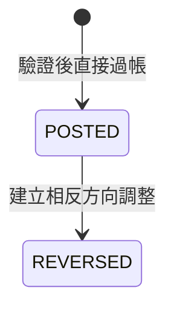

# 狀態轉換與操作規格

> 文件版本：v1.0  
> 建立日期：2026-10-05  
> 最後更新：  
> 文件定位：將產品需求、業務流程、角色權限、領域規則及邏輯資料模型轉為可實作的狀態、操作、前置條件與結果，作為畫面、API、後端服務及測試案例的共同參考。

---

## 1. 文件範圍

本文件定義以下資料的狀態與主要操作：

- 客戶、供應商、公司料號、客戶料號對應及客戶價格。
- 銷售訂單 SO 與未出貨餘量取消申請。
- 採購單 PO 與收貨入庫。
- 出貨單 DO。
- 應收、收款及核銷。
- 庫存調整。
- 共用送審、核准、退回與替代核准。

本文件不定義 HTTP 路徑、DTO 欄位、資料庫型別或畫面配置；HTTP 與畫面交互見 [API 與畫面契約](12-api-and-screen-contracts.md)，實體關係與完整性規則見 [邏輯資料模型](10-data-model.md)。

## 2. 共用規則

### 2.1 狀態與執行狀態分離

- 單據的核准狀態，用來表示資料是否已經主管確認。
- 收貨、出貨、付款等執行結果，由各自的交易資料與狀態表示，不以核准狀態代替。
- 核准 SO 不代表已出貨；核准 PO 不代表已到貨；確認應收不代表已收款。

### 2.2 共用送審規則

| 操作 | 執行角色 | 前置條件 | 成功結果 | 主要失敗原因 |
| --- | --- | --- | --- | --- |
| 儲存草稿 | 該資料的建立角色 | 具建立權限；符合草稿最低欄位 | 保存草稿，不觸發後續交易 | 無建立權限、資料格式錯誤、版本衝突 |
| 送審 | 建立者或具相應權限者 | 必填資料完整；引用主檔仍可使用；目前沒有待處理申請 | 建立新一輪 `approval_request`，目標轉為待核准或待覆核 | 主檔停用、缺少必要資料、價格未啟用、已存在待審申請 |
| 退回 | 對應主管或替代核准者 | 申請仍待處理；操作者具核准權限 | 保存退回意見，目標回到可修改狀態 | 申請已處理、無權限、版本衝突 |
| 重新送審 | 建立者或具相應權限者 | 已依退回意見修改且再次通過送審檢查 | 建立新的申請輪次，保留先前歷程 | 必填資料仍不完整、主檔已失效、仍有待審申請 |
| 核准或覆核 | 對應主管或替代核准者 | 申請仍待處理；操作者不是目標建立者，也不是本輪送審者 | 保存核准動作，目標進入生效狀態，並執行該類資料的後續效果 | 自我核准、無權限、申請已處理、資料版本已變更、後續效果驗證失敗 |

核准服務必須同時驗證：

```text
核准者 ≠ 目標資料建立者
且
核准者 ≠ 本輪送審者
```

如果原核准人不符合條件，案件交由其他具相應核准權限者處理；客戶、SO、供應商及 PO 才可由具替代核准權限的 MANAGER 處理。系統須保存實際操作角色及替代核准標記。

### 2.3 操作紀錄

重要操作至少保存實際操作者、操作時間、操作結果、必要原因及資料版本。狀態轉換與其產生的庫存異動、預留事件、PDF 或應收資料，必須在同一資料庫交易中完成或全部失敗。

## 3. 主檔狀態與操作

### 3.1 客戶、供應商、公司料號與客戶料號對應



| 狀態 | 意義 | 允許的主要操作 |
| --- | --- | --- |
| `DRAFT` | 尚未送審，可由建立者修改 | 編輯、送審 |
| `PENDING_APPROVAL` | 等待對應主管處理 | 查看、核准、退回 |
| `RETURNED` | 已退回建立者修改 | 編輯、重新送審 |
| `ACTIVE` | 已核准並可供交易使用 | 查看、停用；付款條件依財務權限另行設定 |
| `INACTIVE` | 不再供新交易選用，但保留歷史關聯 | 查看、在符合權限時重新啟用 |

已被交易引用的主檔不得實體刪除。客戶、公司料號及客戶料號對應由 SALES_MANAGER 停用或重新啟用；供應商由 PURCHASING_MANAGER 處理。這些操作不另走核准，但必須填寫原因並保存異動紀錄；重新啟用前須確認唯一性、必要關聯與資料衝突。APP_ADMIN 不得因管理帳號而調整業務主檔狀態。

### 3.2 客戶價格



| 操作 | 執行角色 | 前置條件 | 成功結果 |
| --- | --- | --- | --- |
| 建立價格版本 | SALES | 客戶料號對應已啟用；單價與計價單位有效 | 建立 `PENDING_REVIEW` 價格 |
| 覆核價格 | SALES_MANAGER | 不得覆核自己建立或送審的版本 | 新版本轉為 `ACTIVE`；同一客戶料號與計價單位的舊 `ACTIVE` 同時轉為 `REPLACED` |
| 拒絕價格 | SALES_MANAGER | 價格仍為 `PENDING_REVIEW` | 轉為 `REJECTED` 並保存意見 |
| 撤銷錯誤價格 | SALES_MANAGER 或具相應權限者 | 價格目前為 `ACTIVE`，且須填寫原因 | 轉為 `REVOKED`；不得供新的 SO 送審 |

`REJECTED`、`REPLACED` 與 `REVOKED` 只供歷史查詢。SO 草稿可以暫時缺少價格，但送審時必須引用一筆 `ACTIVE` 價格。

### 3.3 客戶付款條件

付款條件不另走核准流程。新客戶預設為 `DUE_0`，FINANCE_MANAGER 或具相應細部權限者可直接修改為 `DUE_0 / NET_30 / NET_60`。修改須填寫原因並保存修改前後值、操作者與時間；其他角色只能查看。

## 4. 銷售訂單 SO

### 4.1 狀態圖



SO 的已預留、已規劃未下單、採購在途、已出貨、已取消與尚待規劃供應量是履約資料或衍生值，不另外作為 SO 核准狀態。

### 4.2 操作矩陣

| 操作 | 執行角色 | 來源狀態 | 前置條件 | 目標狀態與結果 | 主要失敗原因 |
| --- | --- | --- | --- | --- | --- |
| 建立草稿 | SALES；LINE AI 經本人確認後呼叫相同服務 | 無 | 客戶可辨識；至少具備草稿最低資料 | `DRAFT` | 無權限、客戶不存在或停用、重複請求 |
| 編輯草稿 | SALES 或該 SO 授權人員 | `DRAFT / RETURNED` | 未有待處理申請；版本一致 | 維持原狀態 | 無權限、版本衝突、資料已進入核准中 |
| 送審 | SALES 或具相應權限者 | `DRAFT / RETURNED` | 客戶、公司料號、客戶料號對應及 `ACTIVE` 價格可使用；數量、單位及交貨資料完整 | `PENDING_APPROVAL`；保存價格、稅率、付款條件、單位換算與交貨資料 | 缺少有效價格、主檔停用、換算不存在、必要欄位缺漏 |
| 退回 | SALES_MANAGER 或替代核准者 | `PENDING_APPROVAL` | 申請仍待處理 | `RETURNED`；保存退回意見 | 無權限、申請已處理 |
| 核准 | SALES_MANAGER 或替代核准者 | `PENDING_APPROVAL` | 通過自我核准檢查；客戶、客戶料號對應及公司料號仍為啟用；引用價格未被撤銷；重新驗證交易快照與庫存 | `APPROVED`；依可用庫存建立預留，產生供應狀態與尚待規劃供應量 | 自我核准、交易主檔已停用、引用價格已被撤銷、併發造成數量檢查失敗 |
| 建立關聯 PO 草稿 | PURCHASING | `APPROVED` | SO 明細仍有尚待規劃供應量 | SO 狀態不變；建立關聯 PO 草稿並更新已規劃未下單量 | SO 未核准、需求已被其他 PO 規劃、數量超過尚待規劃量 |
| 通知本次出貨 | SALES | `APPROVED` | 選定數量均有有效預留；同一 SO 明細所有有效 DO 草稿合計不超過預留 | 以預計出貨量建立 `DRAFT` DO | 尚未備齊、已被其他 DO 占用、SO 已結案 |
| 履約結案 | 系統 | `APPROVED` | 每筆 SO 明細的有效訂購數量均已由已過帳 DO 出貨或由已核准取消申請取消 | `CLOSED` | 尚有未出貨且未取消數量 |

SO 核准前不得建立關聯 PO 或 DO。SO 核准後的重要交易條件不得直接改寫；未出貨需求的減少透過餘量取消申請處理。

待核准 SO 引用的價格若已轉為 `REPLACED`，表示後續正常換價，不阻擋核准，仍使用送審快照。若價格轉為 `REVOKED`，核准命令回傳 `SO_PRICE_REVOKED`，SO 維持 `PENDING_APPROVAL`；主管須手動退回並留下意見，業務重新送審時再引用目前的 `ACTIVE` 價格。已核准 SO 不因來源價格日後被撤銷而回溯修改，也不因此阻擋既有出貨與應收流程。

## 5. 未出貨餘量取消



| 操作 | 執行角色 | 前置條件 | 成功結果 | 主要失敗原因 |
| --- | --- | --- | --- | --- |
| 建立申請 | SALES | SO 為 `APPROVED`；取消量不超過未出貨且未被有效 DO 占用的餘量 | 建立取消草稿 | SO 已結案、取消量超過餘量 |
| 送審 | SALES | 原因及明細完整 | `PENDING_APPROVAL` | 缺少原因、數量已因出貨或其他取消而改變 |
| 核准 | SALES_MANAGER | 通過自我核准與即時數量檢查 | `APPROVED`；減少有效需求、釋放相應預留並重新計算 SO 是否結案 | 自我核准、數量已被 DO 占用、併發造成餘量不足 |
| 退回 | SALES_MANAGER | 申請仍待處理 | `RETURNED` | 無權限、申請已處理 |

## 6. 採購單 PO 與收貨

### 6.1 PO 狀態圖



PO 表頭狀態反映整張 PO 的核准及收貨結果；每筆明細另以 `OPEN / COMPLETED / CLOSED_SHORT / CANCELLED` 表示供應進度。

### 6.2 PO 操作矩陣

| 操作 | 執行角色 | 來源狀態 | 前置條件 | 目標狀態與結果 | 主要失敗原因 |
| --- | --- | --- | --- | --- | --- |
| 由 SO 缺料建立草稿 | PURCHASING | 無 | 來源 SO 已核准；指定數量仍為尚待規劃供應量 | `DRAFT`；明細關聯一筆 SO 明細 | SO 未核准、需求已被其他 PO 規劃、供應商停用 |
| 建立一般補庫草稿 | PURCHASING | 無 | 公司料號可採購；供應商已啟用 | `DRAFT`；明細不關聯 SO | 無權限、主檔停用 |
| 編輯草稿 | PURCHASING | `DRAFT / RETURNED` | 未有待處理申請 | 維持原狀態 | 已送審、版本衝突 |
| 送審 | PURCHASING | `DRAFT / RETURNED` | 供應商、商品、數量、單位、未稅採購單價與預計到貨日完整 | `PENDING_APPROVAL` | 欄位缺漏、供應商停用、來源 SO 需求不足 |
| 退回 | PURCHASING_MANAGER 或替代核准者 | `PENDING_APPROVAL` | 申請仍待處理 | `RETURNED` | 無權限、申請已處理 |
| 核准並下單 | PURCHASING_MANAGER 或替代核准者 | `PENDING_APPROVAL` | 通過自我核准；來源 SO 需求仍有效 | `APPROVED`；產生唯一正式 PO PDF，未到貨量列為採購在途 | 自我核准、來源需求變動、正式編號或 PDF 產生失敗 |
| 放棄草稿 | PURCHASING | `DRAFT / RETURNED` | 尚未核准 | `CANCELLED`；解除草稿對尚待規劃量的占用 | 已進入核准或已有收貨 |
| 取消已核准 PO | PURCHASING_MANAGER | `APPROVED` | 尚未有任何已過帳收貨；必填原因 | `CANCELLED`；PO 與正式 PDF 標記取消／作廢，未到貨量移出在途，來源 SO 重新計算尚待規劃量 | 已有收貨、無權限、缺少原因 |
| 短收結案 | PURCHASING_MANAGER | `PARTIALLY_RECEIVED` | 供應商不再交付剩餘數量；必填原因 | 未到貨餘量轉為取消量，明細轉為 `CLOSED_SHORT`；全部明細完成後 PO 轉為 `CLOSED`，來源 SO 重新計算尚待規劃量 | 無權限、缺少原因、PO 已結案 |

### 6.3 收貨與入庫

| 操作 | 執行角色 | 前置條件 | 成功結果 | 主要失敗原因 |
| --- | --- | --- | --- | --- |
| 建立並過帳收貨 | WAREHOUSE | PO 已核准且明細仍有未結數量；實收拆分為合格、損壞及規格不符 | 建立 `POSTED` 收貨紀錄；只有合格數量增加實體庫存；關聯 PO 的合格數量優先預留給來源 SO | PO 未核准、實收超過可收數量、數量合計不一致、併發衝突 |
| 更新 PO 收貨進度 | 系統 | 收貨成功過帳 | 部分收貨時 PO 轉為 `PARTIALLY_RECEIVED`；全部明細完成時轉為 `CLOSED` | 無 |

過帳前，系統須顯示 PO、品項、實收、合格、損壞及規格不符數量供倉管再次確認。收貨過帳後不得修改或刪除，本次交付版本也不提供收貨沖銷；庫存調整不得用來偽裝更正 PO 收貨進度。損壞及規格不符數量只保留於驗收紀錄，不進入可出貨庫存。

## 7. 出貨單 DO



| 操作 | 執行角色 | 來源狀態 | 前置條件 | 目標狀態與結果 | 主要失敗原因 |
| --- | --- | --- | --- | --- | --- |
| 建立 DO 草稿 | SALES | 無 | SO 已核准；預計出貨量均已預留；有效 DO 草稿合計不超過預留 | `DRAFT`；保存預計出貨量 | SO 未核准、預留不足、數量已被其他 DO 占用 |
| 調整 DO 草稿 | WAREHOUSE | `DRAFT` | 預計出貨量不超過來源 SO 明細有效預留；尚未產生正式 PDF | 維持 `DRAFT` | 預留不足、跨 SO 明細、版本衝突 |
| 完成揀貨並產生出貨單 | WAREHOUSE | `DRAFT` | 每筆實際出貨量大於 0 且不超過預計出貨量 | `READY`；保存實際出貨量並據此產生有正式編號的唯一 DO PDF；少出的差額繼續保留在 SO 預留 | 數量不符、預留不足、PDF 產生失敗 |
| 出貨過帳 | WAREHOUSE | `READY` | 貨物及文件已交付司機；輸入實際出貨日；重新檢查實體數量與預留 | `POSTED`；扣減實體庫存、使用預留、自動建立一筆應收草稿 | 尚未 `READY`、庫存或預留不足、重複過帳、日期不合法、併發衝突 |
| 作廢 | WAREHOUSE 或具相應權限者 | `DRAFT / READY` | 尚未過帳；必填原因 | `VOIDED`；`READY` 的 PDF 同時作廢，不扣庫存或使用預留 | 已過帳、無權限、缺少原因 |

`POSTED` DO 不直接作廢。需更正 `READY` 內容時，作廢原 DO 及 PDF，再建立新 DO；每張 DO 只保存一份正式 PDF。

## 8. 應收與收款

### 8.1 應收狀態



| 操作 | 執行角色 | 前置條件 | 成功結果 | 主要失敗原因 |
| --- | --- | --- | --- | --- |
| 自動建立應收草稿 | 系統 | DO 成功過帳且尚未產生應收 | `PENDING_CONFIRMATION`；依實際出貨量、SO 未稅價格、5% 稅率及付款條件計算金額與到期日 | DO 已有應收、計算資料不完整；此時 DO 過帳交易整體失敗 |
| 確認正式應收 | FINANCE | `PENDING_CONFIRMATION`；外部發票號碼與日期完整且未重複 | `OPEN` | 發票號碼重複、金額與 DO 計算結果不一致、版本衝突 |
| 更正外部發票資料 | FINANCE_MANAGER | 應收已正式確認；只修改發票號碼或日期；必填原因 | 應收狀態與金額不變；保存修改前後值、操作者與時間 | 無權限、發票號碼重複、嘗試修改金額／付款條件／到期日／來源 DO、缺少原因 |
| 登錄並核銷收款 | FINANCE | 應收為 `OPEN / PARTIALLY_PAID`；同一筆收款只核銷同一客戶的應收；分配總額等於收款金額 | 建立 `CONFIRMED` 收款與核銷明細；應收依餘額轉為 `PARTIALLY_PAID / PAID` | 超額核銷、跨客戶核銷、分配總額不符、應收已結清、併發衝突 |
| 作廢收款 | FINANCE_MANAGER | 收款為 `CONFIRMED`；必填原因 | 收款轉為 `VOIDED`；核銷失效，重新計算相關應收狀態及未收餘額 | 收款已作廢、無權限、缺少原因 |

收款不保存草稿狀態；財務可在確認前於畫面調整分配內容，確認成功後才建立 `CONFIRMED` 收款。系統不接受預收、溢收或未分配款。

## 9. 庫存調整



| 操作 | 執行角色 | 前置條件 | 成功結果 | 主要失敗原因 |
| --- | --- | --- | --- | --- |
| 過帳庫存調整 | WAREHOUSE_MANAGER 或具相應細部權限者 | 必填原因；調整後實體數量不得為負；調減不得侵蝕有效預留 | 建立 `POSTED` 調整與庫存異動 | 無權限、原因缺漏、實體數量不足、調減會侵蝕預留、併發衝突 |
| 建立期初庫存 | WAREHOUSE_MANAGER 或具相應細部權限者 | 類型為 `OPENING_BALANCE`；數量為正；該料號尚無庫存異動、預留或交易引用，且未建立過期初庫存 | 建立 `POSTED` 調整與庫存異動 | 已開始交易、已存在期初庫存、數量不合法、併發衝突 |
| 更正已過帳調整 | WAREHOUSE_MANAGER 或具相應細部權限者 | 原調整為 `POSTED`；相反方向調整仍通過相同數量規則 | 新增一筆 `POSTED` 相反方向調整，原調整標記 `REVERSED` | 原調整已更正、相反方向調整會造成負庫存或侵蝕預留 |

庫存調整不建立預留事件，也不自動或手動改配既有缺料 SO。若調減會侵蝕預留，系統拒絕操作並列出可能受影響的 SO。

## 10. 狀態轉換的 API 與測試要求

[API 與畫面契約](12-api-and-screen-contracts.md) 將每個會改變狀態的操作設計為明確命令，例如「送審」「核准」「完成揀貨」「出貨過帳」「確認應收」，不使用通用更新 API 任意改寫狀態欄位。

每個狀態操作至少需驗證：

1. 使用者身分、角色、細部權限及資料範圍。
2. 目前狀態是否允許該操作。
3. 前端帶入的資料版本是否仍為最新。
4. 所有引用主檔及來源單據是否仍可使用。
5. 數量、金額、唯一性與自我核准限制。
6. 重複送出時是否受到狀態、版本、唯一限制或該操作專用識別碼的防護。
7. 操作成功後，目標狀態、歷程、異動及衍生資料是否同時正確。

整合測試至少涵蓋正常轉換、錯誤來源狀態、無權限、自我核准、重複送出、版本衝突及數量併發等情境。

## 11. 與其他文件的關係

- [API 與畫面契約](12-api-and-screen-contracts.md) 依本文件建立明確的命令操作，不開放任意修改狀態。
- 實體資料庫設計須提供狀態限制、唯一性、外鍵、交易鎖定及稽核欄位。
- 整合測試須以本文件的前置條件、成功結果及失敗原因建立案例。
- 若後續實作需要新增狀態或例外流程，應先更新需求或決策紀錄，再同步修改本文件與資料模型。
