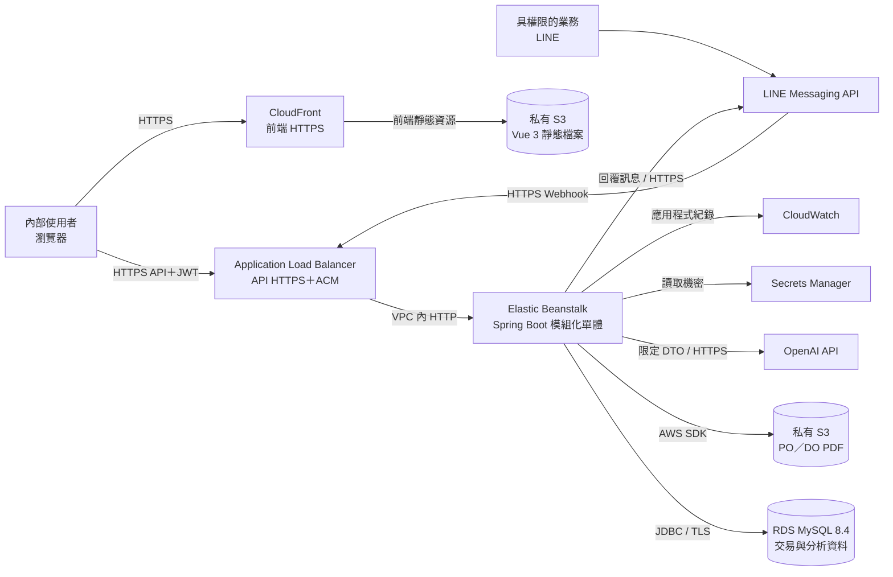
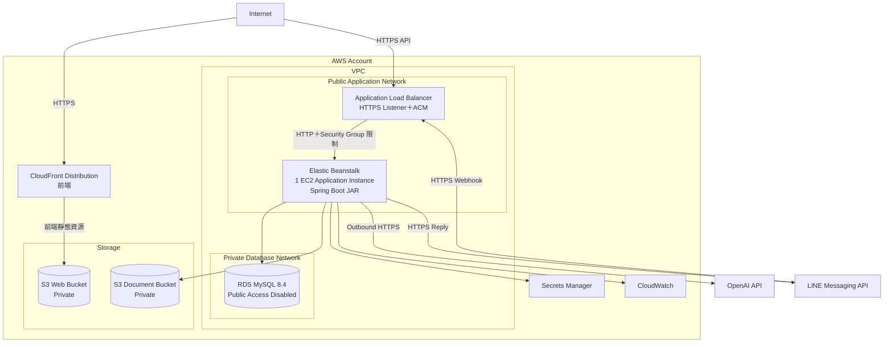
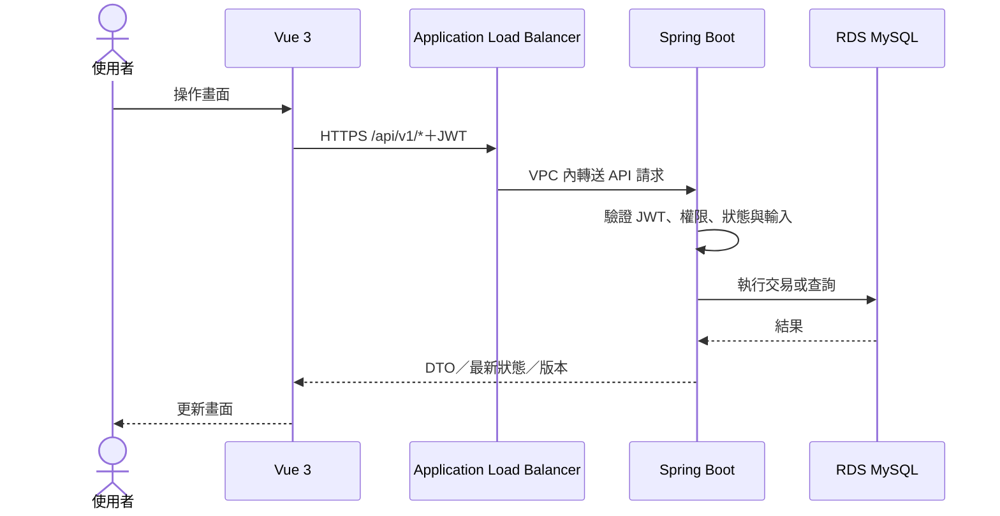
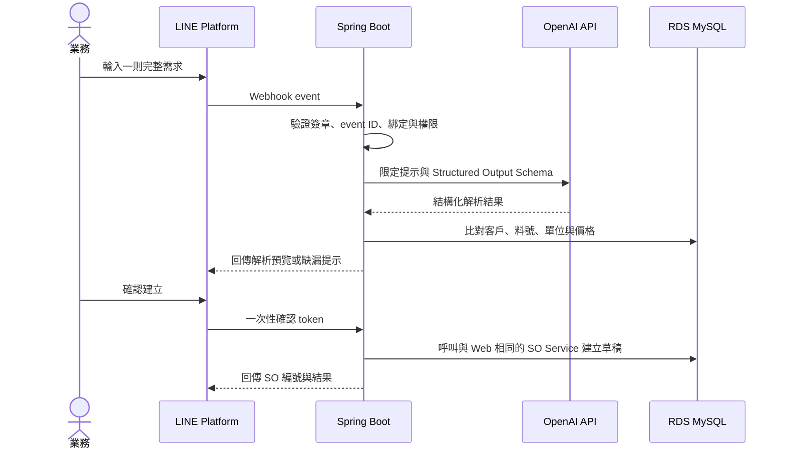
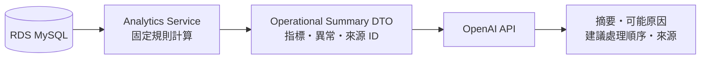
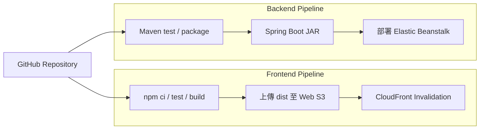

# 系統架構

> 文件版本：v1.0  
> 建立日期：2026-10-05  
> 最後更新：  
> 文件定位：說明系統元件、部署方式、後端模組邊界、外部整合、安全責任與主要資料流，作為開發、部署及簡報架構圖的共同參考。

---

## 1. 架構目標與原則

- 前端、後端與資料儲存分開部署：CloudFront 提供前端 HTTPS，ALB 提供 API HTTPS。
- 後端採 Spring Boot 模組化單體，不拆分微服務。
- 程式碼先依業務領域分組，再於各領域內分為 Controller、DTO、Service、Entity 與 Repository。
- 核心交易使用同一個 MySQL 資料庫交易，避免為跨服務一致性增加額外複雜度。
- AI 只能接收後端限定的結構化資料或文字，不直接查詢資料庫，也不得繞過既有權限與業務服務。
- PDF、帳號密碼與 AI 金鑰不存入程式碼或 Git 版本庫。
- 展示環境以可部署、可操作及可追溯為優先，不導入不必要的分散式元件。

## 2. 技術與部署決策

| 範圍 | 採用方案 | 說明 |
| --- | --- | --- |
| 前端 | Vue 3、Vite | 建置後產生靜態 `dist` 檔案 |
| 前端部署 | 私有 S3＋CloudFront | S3 不公開，由 CloudFront Origin Access Control 讀取 |
| 後端 | Spring Boot、Spring Security、Spring AI | 提供 REST API、JWT 驗證、業務交易與 AI 整合 |
| 後端部署 | Elastic Beanstalk Java SE＋Application Load Balancer | 直接部署可執行 JAR；Load-balanced Environment 的執行個體數固定為 1 |
| 架構型態 | 模組化單體 | 單一部署單元、單一關聯式資料庫，程式內維持領域邊界 |
| 資料庫 | Amazon RDS for MySQL 8.4 | 使用 InnoDB、`utf8mb4`，資料時間以 UTC 保存 |
| 正式文件 | 獨立私有 S3 Bucket | 只保存正式 PO 與 DO PDF；資料庫保存物件位置及文件資訊 |
| AI | OpenAI API | LINE 訂單解析及營運摘要；不部署本機模型 |
| LINE | LINE Messaging API | Webhook 進入相同 Spring Boot 應用程式 |
| 機密資訊 | AWS Secrets Manager | 保存資料庫密碼、OpenAI API Key、LINE Channel Secret 等 |
| 紀錄與監控 | Amazon CloudWatch | 收集應用程式 Log、部署狀態及環境健康資訊 |

本次架構不使用 ECS、EKS、Kafka、Redis、向量資料庫、Ollama 或微服務。未來若流量、團隊或獨立擴展需求出現，再依實際量測結果評估調整。

## 3. 系統元件總覽



### 3.1 元件責任

| 元件 | 主要責任 | 不負責的事項 |
| --- | --- | --- |
| Vue 3 | 畫面呈現、輸入驗證、權限提示及呼叫 API | 不自行判定最終權限、狀態或交易結果 |
| CloudFront | 前端 HTTPS 入口與靜態內容快取 | 不代理 API，不執行業務規則 |
| Application Load Balancer | API 的 HTTPS 入口、ACM 憑證、健康檢查與轉送 | 不執行 JWT 授權或業務規則 |
| Spring Boot | 身分驗證、授權、交易規則、跨模組協調、PDF、分析及 AI 整合 | 不將業務決策交給前端或 AI |
| RDS MySQL | 保存主檔、交易、狀態、稽核及 AI 摘要來源資料 | 不保存 PDF 本體或 API 金鑰 |
| 文件 S3 | 保存正式 PO／DO PDF | 不保存可任意公開存取的文件 |
| OpenAI API | 將限定輸入轉為結構化解析結果或文字摘要 | 不直接讀取資料庫，不直接建立或核准交易 |
| LINE Messaging API | 接收業務輸入並傳遞系統回覆 | 不作為使用者授權依據 |

## 4. AWS 部署架構



### 4.1 公開入口與網域

| 入口 | 目標 | 原則 |
| --- | --- | --- |
| `https://app.<domain>` 或 CloudFront 網域 | Vue Web S3 | 主要提供 `GET / HEAD`；含雜湊檔名的靜態資源可長時間快取 |
| `https://api.<domain>/api/v1` | ALB → Elastic Beanstalk | 允許 REST API 所需方法；ALB 使用 ACM 憑證；JWT 由 Spring Security 驗證 |

- Vue Router 使用 History Mode 時，CloudFront 只對前端路徑進行 `index.html` fallback。
- 前端建置時使用環境變數設定 `VITE_API_BASE_URL=https://api.<domain>/api/v1`，不將實際網域寫死在原始碼。
- 後端 CORS 只允許指定的正式前端來源與本機開發來源，不使用萬用字元。
- LINE webhook 使用 `https://api.<domain>/api/integrations/line/webhook`，不經過 CloudFront。

### 4.2 Elastic Beanstalk

- 使用 Java SE Platform 部署單一 Spring Boot executable JAR，不要求 Docker。
- 採 Load-balanced Environment，ALB 建立 HTTPS Listener 並使用 ACM 憑證。
- 展示環境的 Auto Scaling 最小與最大執行個體數均設為 1，不代表需要同時運行多台應用主機。
- 應用程式提供健康檢查端點，例如 `/actuator/health`。
- ALB 到 EC2 先採 VPC 內 HTTP；EC2 的入站規則只允許 ALB Security Group 存取應用連接埠。
- 單一執行個體仍可能在部署、重啟或主機異常期間暫時無法服務；未來可將最小與最大數量提高以增加可用性。
- RDS 必須獨立建立，不與 Beanstalk 環境生命週期綁定。

### 4.3 S3 儲存責任

使用兩個不同 Bucket：

```text
smart-distribution-web
└── Vue 3 dist 靜態檔案

smart-distribution-documents
├── purchase-orders/{year}/{po-number}.pdf
└── delivery-orders/{year}/{do-number}.pdf
```

- Web Bucket 由 CloudFront OAC 唯讀存取，不開放直接公開讀取。
- Document Bucket 只允許後端 IAM Instance Profile 存取。
- MySQL 的 `document_file` 只保存文件類型、來源單據、S3 object key、檔案大小、雜湊、建立時間及作廢資訊。
- PDF 下載須先通過後端權限檢查並留下「下載連結核發」紀錄，再由後端產生 3 分鐘有效的 S3 Presigned URL，以 `302 Redirect` 導向 S3 下載。短效網址不得保存於資料庫或寫入 Log；如需證明使用者確實完成下載，須另行啟用 S3 存取紀錄，不以連結核發紀錄代替。

## 5. 後端模組化單體

### 5.1 模組邊界

| 模組 | 主要責任 |
| --- | --- |
| `identity` | 登入、使用者、角色、權限與 JWT |
| `masterdata` | 客戶、供應商、公司料號、客戶料號、價格、單位與付款條件 |
| `approval` | 共用送審、核准、退回與替代核准紀錄 |
| `sales` | SO、價格快照、核准後供應狀態及餘量取消 |
| `procurement` | PO、關聯 SO 需求、採購在途、取消與短收結案 |
| `inventory` | 收貨、庫存餘額、異動、預留、調整及一致性檢查 |
| `fulfillment` | DO、揀貨、正式出貨單及出貨過帳 |
| `finance` | 客戶應收、外部發票資料、收款及核銷；不含供應商應付與付款 |
| `analytics` | 儀表板指標、風險規則、趨勢及來源下鑽 |
| `ai` | OpenAI Client、LINE 解析 DTO、營運摘要輸入輸出及防護 |
| `integration.line` | LINE 綁定碼、帳號綁定、Webhook、簽章、event ID 防重與確認流程 |
| `document` | PO／DO PDF 產生、S3 存取及文件狀態 |
| `audit` | 重要操作、授權異動及資料前後值紀錄 |

模組名稱對應 [03-functional-modules.md](03-functional-modules.md) 的產品模組，但程式模組可以依共同交易責任適度合併；不要求每個產品模組都成為獨立部署服務。

### 5.2 Package 結構

採用「領域優先、領域內分層」：

```text
com.example.smartdistribution
├── sales
│   ├── controller
│   ├── dto
│   ├── service
│   ├── entity
│   └── repository
├── procurement
│   ├── controller
│   ├── dto
│   ├── service
│   ├── entity
│   └── repository
├── inventory
│   ├── controller
│   ├── dto
│   ├── service
│   ├── entity
│   └── repository
├── fulfillment
├── finance
├── analytics
├── ai
├── integration
│   └── line
└── shared
    ├── config
    ├── security
    ├── exception
    └── persistence
```

共用規則：

- Controller 只處理 HTTP 契約、基本格式驗證及呼叫 Service。
- Service 負責交易邊界、權限後的業務操作及跨模組協調。
- Repository 只由所屬模組的 Service 使用；其他模組不得直接修改其資料。
- Entity 保存狀態及必要一致性行為，但不直接呼叫外部 API。
- DTO 不直接作為 JPA Entity，也不將 Entity 原樣回傳前端。
- `shared` 只放真正跨模組的技術能力，不作為無法分類程式碼的集中區。

### 5.3 跨模組交易

以下流程必須由應用服務在單一 MySQL 交易中完成，任一步驟失敗時全部回復：

- SO 核准、庫存預留與供應狀態更新。
- PO 合格收貨、庫存增加、PO 進度更新與來源 SO 預留補足。
- DO 過帳、庫存扣減、預留使用、SO 履約更新與應收草稿建立。
- 收款確認、核銷明細建立與應收狀態更新。

核心模組之間以公開的同步 Service 方法協作，不導入應用事件、Kafka、Outbox 或分散式交易。會影響核心一致性的流程由外層應用 Service 控制同一個 MySQL 交易；非關鍵通知若未來出現明確需求，再另行評估事件機制。

## 6. 主要資料流

### 6.1 Web API



### 6.2 LINE AI 建立 SO 草稿



AI 只負責解析，不直接執行 SQL 或建立 SO。最終建立動作須由原發起者確認，並通過與 Web 相同的後端驗證與權限規則。

### 6.3 AI 營運摘要



- 指標、金額、庫存、逾期與風險名單由後端規則計算。
- AI 不自行查詢資料庫，也不自行修改指標結果。
- 傳送給 OpenAI 的內容採資料最小化，只包含完成摘要所需欄位。
- AI 輸出需保留資料期間、產生時間、模型資訊及可回查的來源 ID。

## 7. 安全與權限架構

### 7.1 使用者與 API

- Web 使用 JWT Bearer Token；ALB 將 `Authorization` Header 轉送給 Spring Boot。
- Vue 的按鈕隱藏與停用只提供使用體驗，Spring Security 與業務 Service 仍須重新驗證權限。
- 正式與本機環境皆以 CORS 允許清單限制 Vue 來源。JWT 放在 Bearer Header，本次不以跨網域 Cookie 作為身分憑證。
- APP_ADMIN 不因管理帳號而取得交易、價格、成本或分析權限。
- 建立者與本輪送審者不得核准自己的資料，相關規則於後端及整合測試中強制執行。

### 7.2 AWS 資源

- RDS 關閉 Public Access，只允許 Beanstalk EC2 Security Group 連線 MySQL Port。
- ALB 對 Internet 只開放 HTTPS；Beanstalk EC2 應用連接埠只允許 ALB Security Group。
- Web S3 與 Document S3 均禁止公開存取。
- Beanstalk EC2 Instance Profile 只取得必要的 S3、Secrets Manager 及 CloudWatch 權限。
- OpenAI、LINE、資料庫與 AWS 金鑰不得出現在原始碼、前端 Bundle、Git 或一般 Log。
- 正式 PDF 的下載必須先驗證系統使用者及文件查看權限。

### 7.3 AI 資料保護

- 不把整個資料庫、資料表 Schema 或任意 SQL 能力提供給 AI。
- LINE 解析只提供使用者輸入與必要比對結果；建立交易仍由後端控制。
- 營運摘要只提供已計算的限定 DTO，敏感欄位依摘要目的移除或遮蔽。
- Tool Calling 若使用，只註冊範圍明確、輸入 Schema 固定且可再次授權檢查的工具。

## 8. 建置與部署流程

### 8.1 先完成手動部署

先完成可重複的手動部署：前端建置後上傳 S3，後端測試與打包後上傳 Elastic Beanstalk。GitHub Actions 不作為核心功能驗收的前置條件，待主要資料流及手動部署穩定後，再依下圖自動化。

### 8.2 後續部署自動化



- Pull Request 先執行前後端測試與建置，不在未通過測試時部署。
- 前端發佈後只清除必要 CloudFront 路徑；含內容雜湊的資源可使用長快取。
- 後端部署包只包含執行所需 JAR 與 Beanstalk 設定，不包含任何實際密碼。
- GitHub Actions 屬部署自動化擴充；實作時須使用短期 AWS 憑證，並在啟用自動部署前確認環境與回復策略。

## 9. 架構限制與未來擴充

| 現況 | 限制 | 未來擴充方向 |
| --- | --- | --- |
| Beanstalk 單一應用執行個體 | 部署或主機異常時可能短暫中斷 | 調高 Auto Scaling 最小與最大數量，由既有 ALB 分流 |
| ALB 到 EC2 採 VPC 內 HTTP | 不是端到端 TLS | 若未來出現合規要求，在執行個體配置 HTTPS 並將 Target Group 改為 HTTPS |
| 單一 MySQL | 所有模組共享同一資料庫 | 先以模組邊界與權限隔離；有實際瓶頸後再評估拆分 |
| 即時計算儀表板 | 資料量大時查詢成本可能上升 | 依量測結果增加索引、View、排程彙總或快照 |
| OpenAI 外部 API | 受網路、供應商限流與費用影響 | 加入 timeout、有限重試、錯誤提示及使用量監控 |
| 不使用向量資料庫 | 不提供文件語意搜尋或 RAG | 只有出現明確知識檢索需求時才評估向量儲存 |

## 10. 待確認事項

下列項目不改變目前架構方向，於實際部署前確認：

1. AWS Region、正式前端與 API 網域、DNS 服務及 ACM 憑證配置。
2. Beanstalk EC2 與 RDS 的實際規格、備份天數及展示環境啟停策略。
3. EC2 子網與對外連線方式：展示環境採受 Security Group 限制的公有子網，或私有子網搭配 NAT。
4. Java、Spring Boot、Spring AI 與 Node.js 的固定版本。

上述項目定案後，應更新本文件並同步反映至部署設定；不得在程式碼中以硬編碼繞過環境差異。
